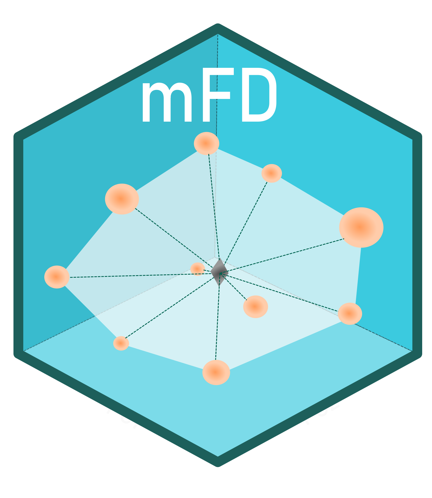

# mFD 

<!-- badges: start -->

[](https://CRAN.R-project.org/package=mFD)
[](https://github.com/CmlMagneville/mFD_shared/actions)
[](https://github.com/CmlMagneville/mFD_shared/docs/index.html)
<!-- badges: end -->

## Introduction

The `mFD` package provides a **“user friendly” interface** to compute a
**global assessment of functional diversity** by gathering computation
of alpha, beta functional indices. As no package before, it guides the
user through functional analysis with one function per action to
complete, several arguments that can be changed and allows personalized
graphical outputs. Various tutorials are available on the mFD website to
guide the user through the functional workflow.

## Installation

The `mFD` package can be installed through CRAN as follow:

``` r
## Coming soon
```

or for the latest development version, the `mFD` Github repository can
be used:

``` r
library(remotes)
remotes::install_github("CmlMagneville/mFD", force = TRUE)
library(mFD)
```

## How to use the `mFD` package?

To compute functional diversity indices, the user needs:

-   a data frame summarizing species traits (species in rows, traits in
    columns). The `mFD` package works with all kind of traits:
    quantitative, ordinal, nominal, circular and fuzzy-coded.

-   a matrix summarizing species gathering into assemblages (assemblages
    in rows, species in columns). All assemblages must at least contain
    one species.

-   a data frame summarizing traits category (first column with traits
    name, second column with traits type, third column with fuzzy name
    of fuzzy traits - if no fuzzy traits: NA).

For a complete understanding of the functional workflow and the packages
possibilities, please refer to the
[General\_mFD\_workflow\_vignette](https://github.com/CmlMagneville/mFD/docs/articles/mFD_general_workflow.html).

## Citation

To cite package `mFD` in publications use:

    __ADD CITATION HERE__

## Contributions

SV, NL, EM, FL, CA and CM wrote the functions. SV, NL and CM wrote
function documentations. SV and CM wrote tutorials.
