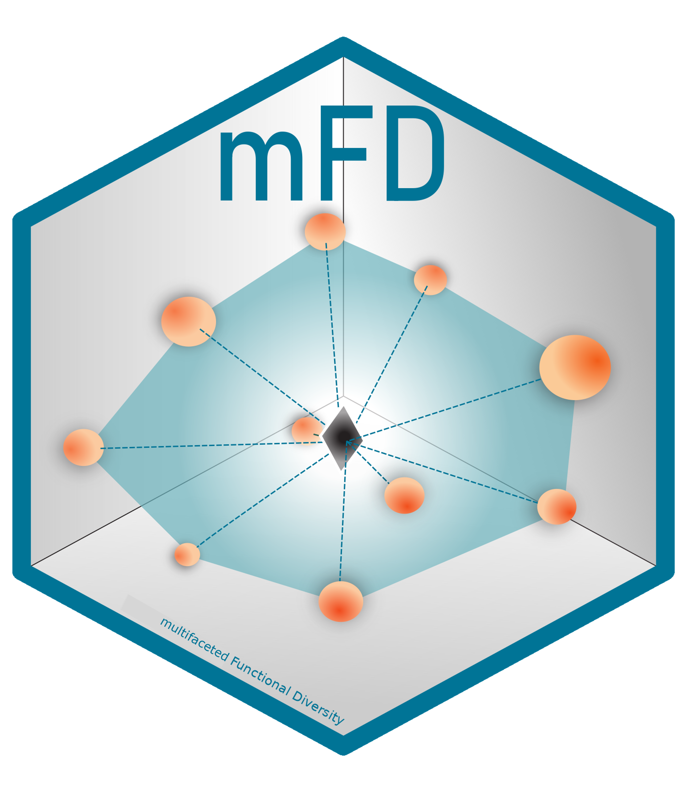

# mFD 

<!-- badges: start -->

[](https://CRAN.R-project.org/package=mFD/)
[](https://github.com/CmlMagneville/mFD/actions/workflows/R-CMD-check.yaml)
[](https://github.com/CmlMagneville/mFD/actions/workflows/pkgdown.yaml)
[](https://choosealicense.com/licenses/gpl-2.0/)
[](https://lifecycle.r-lib.org/articles/stages.html#stable)
[](https://www.repostatus.org/#active)
[](https://cran.r-project.org/package=mFD)
<!-- badges: end -->

The `mFD` package provides a **“user friendly” interface** to compute a
**global assessment of functional diversity** by gathering computation
of alpha and beta functional indices. As no package before, it guides
users through functional analysis with one function per action to
complete, several arguments that can be changed and allows personalized
graphical outputs. Various tutorials are available on the mFD website to
guide the user through the functional workflow.

## Installation

You can install the stable version from
[CRAN](https://cran.r-project.org/) with:

``` r
# Install stable version of < mFD > from CRAN ----
install.packages("mFD")
```

Or you can install the development version from
[GitHub](https://github.com/) with:

``` r
## Install < remotes > package (if not already installed) ----
if (!requireNamespace("remotes", quietly = TRUE)) {
  install.packages("remotes")
}

## Install dev version of < mFD > from GitHub ----
remotes::install_github("CmlMagneville/mFD", build_vignettes = TRUE)
```

## Get started

``` r
library("mFD")
```

To compute functional diversity indices, users need:

-   a data frame summarizing species traits (species in rows, traits in
    columns). The `mFD` package works with all kind of traits:
    quantitative, ordinal, nominal, circular, and fuzzy-coded.

-   a matrix summarizing species gathering into assemblages (assemblages
    in rows, species in columns). All assemblages must at least contain
    one species.

-   a data frame summarizing traits category (first column with traits
    name, second column with traits type, third column with fuzzy name
    of fuzzy traits - if no fuzzy traits: NA).

For a complete understanding of the functional workflow and the package
possibilities, please refer to the [mFD General
Workflow](https://cmlmagneville.github.io/mFD/articles/mFD_general_workflow.html).

## Citation

Please cite this package as:

> Magneville C, Loiseau N, Albouy C, Casajus N, Claverie T, Escalas A,
> Leprieur F, Maire E, Mouillot D & Villeger S (2021) mFD: an R package
> to compute and illustrate the multiple facets of functional diversity.
> *Submitted to Ecography*.

You can also run:

``` r
citation("mFD")
```

## Contributions

SV, NL, CA, FL and CM coded the functions and their help. SV and CM led
tutorial writings. All authors tested the functions and contributed to
writing of helps and tutorials. NC optimized the package and made it
ready for CRAN submission.
