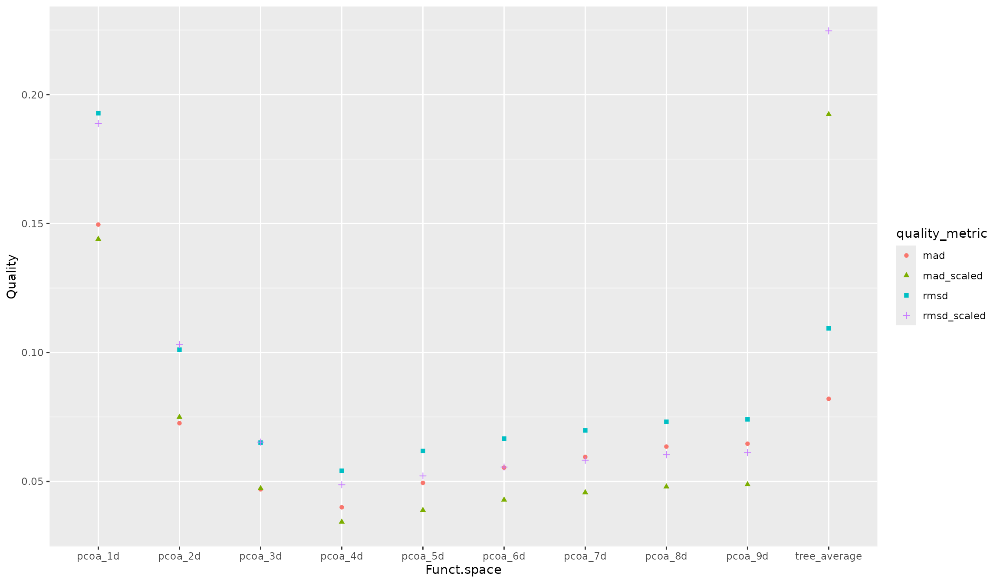
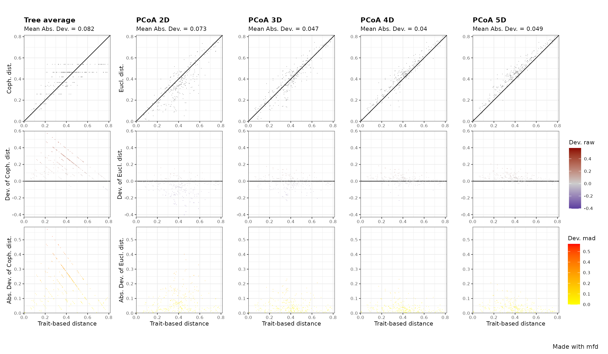
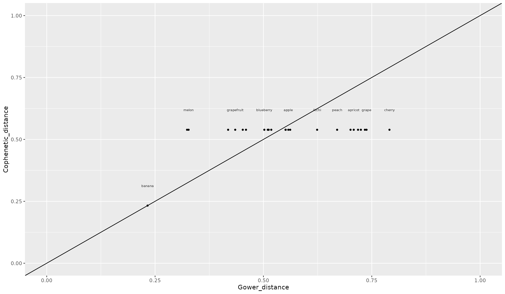
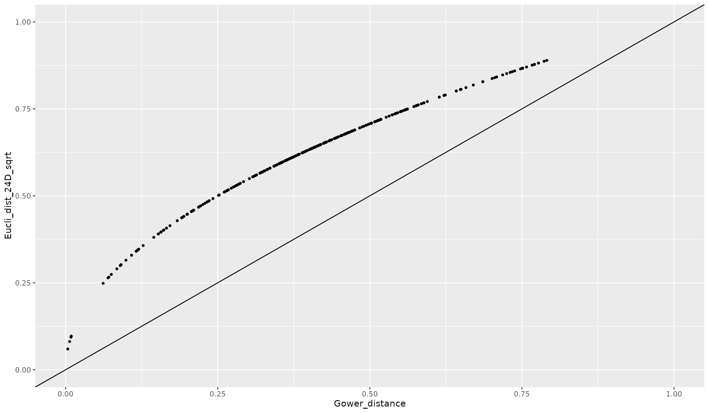

# Compute and Interpret Quality of Functional Spaces

## About this tutorial

  

This tutorial illustrates how to compute and interpret quality of
functional spaces using `mFD`, with a special emphasis on how functional
dendrograms and functional spaces with a low dimension could distort
original trait-based distances. This tutorial also explains why
square-rooting the original distances before computing PCoA may be
misleading.

  

## 1. Tutorial’s data

  

**DATA** The dataset used to illustrate this tutorial is *a fruit
dataset* based on 25 types of fruits. Each fruit is characterized by 5
traits summarized in the following table:

| Trait name | Trait measurement | Trait type  | Number of classes |            Classes code            | Unit |
|:----------:|:-----------------:|:-----------:|:-----------------:|:----------------------------------:|:----:|
|    Size    | Maximal diameter  |   Ordinal   |         5         |   0-1 ; 1-3 ; 3-5 ; 5-10 ; 10-20   |  cm  |
|   Plant    |    Growth form    | Categorical |         4         |      tree; schrub; vine; forb      |  NA  |
|  Climate   |  Climatic niche   |   Ordinal   |         3         | temperate ; subtropical ; tropical |  NA  |
|    Seed    |     Seed type     |   Ordinal   |         3         |          none ; pip ; pit          |  NA  |
|   Sugar    |       Sugar       | Continuous  |        NA         |                 NA                 | g/kg |

  

**NOTE** This dataset is a subset of the dataset used in the [mFD:
General
Workflow](https://cmlmagneville.github.io/mFD/articles/mFD_general_workflow.html)
tutorial to keep only non-fuzzy traits.

  

The dataframe gathering species traits, looks as follows:

  

``` r
data("fruits_traits", package = "mFD")

# remove non-fuzzy traits:
fruits_traits <- fruits_traits[1:5]

# plot the table:
knitr::kable(head(fruits_traits), 
             caption = "Species x traits dataframe based on *fruits* dataset")
```

|            | Size    | Plant | Climate   | Seed | Sugar |
|:-----------|:--------|:------|:----------|:-----|------:|
| apple      | 5-10cm  | tree  | temperate | pip  | 103.9 |
| apricot    | 3-5cm   | tree  | temperate | pit  |  92.4 |
| banana     | 10-20cm | tree  | tropical  | none | 122.3 |
| currant    | 0-1cm   | shrub | temperate | pip  |  73.7 |
| blackberry | 1-3cm   | shrub | temperate | pip  |  48.8 |
| blueberry  | 0-1cm   | forb  | temperate | pip  | 100.0 |

Species x traits dataframe based on *fruits* dataset

  

Thus, this dataset contains 5 traits: 3 ordinal (Size, Climate, Seed), 1
categorical (Plant type), 1 continuous (sugar content):

  

    ##       Size     Plant           Climate     Seed        Sugar       
    ##  0-1cm  :2   forb : 5   temperate  :15   none: 2   Min.   : 16.90  
    ##  1-3cm  :6   shrub: 3   subtropical: 4   pip :17   1st Qu.: 73.70  
    ##  3-5cm  :5   tree :14   tropical   : 6   pit : 6   Median : 92.40  
    ##  5-10cm :6   vine : 3                              Mean   : 90.66  
    ##  10-20cm:6                                         3rd Qu.:105.80  
    ##                                                    Max.   :162.50

  

These traits are summed up in the following dataframe (details: [mFD:
General
Workflow](https://cmlmagneville.github.io/mFD/articles/mFD_general_workflow.html)
tutorial):

  

``` r
fruits_traits_cat <- data.frame(names(fruits_traits), c("O","N","O","O","Q"))
colnames(fruits_traits_cat) <- c("trait_name", "trait_type")
fruits_traits_cat
```

    ##   trait_name trait_type
    ## 1       Size          O
    ## 2      Plant          N
    ## 3    Climate          O
    ## 4       Seed          O
    ## 5      Sugar          Q

  

## 2. Compute trait-based distance between species

  

First, trait-based distance between species should be computed using
[`mFD::funct.dist()`](https://cmlmagneville.github.io/mFD/reference/funct.dist.md).
Here we use Gower distance.

  

**USAGE**

``` r
# compute trait-based distances:
dist_fruits <- mFD::funct.dist(
  sp_tr         = fruits_traits,
  tr_cat        = fruits_traits_cat,
  metric        = "gower",
  scale_euclid  = "noscale",
  ordinal_var   = "classic",
  weight_type   = "equal",
  stop_if_NA    = TRUE)

# sum up the distance matrix:
summary(as.matrix(dist_fruits))
```

    ##      apple           apricot           banana          currant      
    ##  Min.   :0.0000   Min.   :0.0000   Min.   :0.0000   Min.   :0.0000  
    ##  1st Qu.:0.1658   1st Qu.:0.2184   1st Qu.:0.3448   1st Qu.:0.3723  
    ##  Median :0.2848   Median :0.3607   Median :0.5027   Median :0.4257  
    ##  Mean   :0.2813   Mean   :0.3285   Mean   :0.4774   Mean   :0.4317  
    ##  3rd Qu.:0.3805   3rd Qu.:0.4165   3rd Qu.:0.5945   3rd Qu.:0.5169  
    ##  Max.   :0.5574   Max.   :0.7084   Max.   :0.7668   Max.   :0.7864  
    ##    blackberry       blueberry          cherry           grape       
    ##  Min.   :0.0000   Min.   :0.0000   Min.   :0.0000   Min.   :0.0000  
    ##  1st Qu.:0.3565   1st Qu.:0.3269   1st Qu.:0.2422   1st Qu.:0.3562  
    ##  Median :0.4099   Median :0.4011   Median :0.4089   Median :0.4370  
    ##  Mean   :0.4102   Mean   :0.4094   Mean   :0.3689   Mean   :0.4447  
    ##  3rd Qu.:0.4834   3rd Qu.:0.5165   3rd Qu.:0.4526   3rd Qu.:0.5140  
    ##  Max.   :0.7706   Max.   :0.7503   Max.   :0.7908   Max.   :0.7379  
    ##    grapefruit       kiwifruit          lemon             lime       
    ##  Min.   :0.0000   Min.   :0.0000   Min.   :0.0000   Min.   :0.0000  
    ##  1st Qu.:0.2648   1st Qu.:0.2804   1st Qu.:0.2084   1st Qu.:0.3360  
    ##  Median :0.3265   Median :0.3628   Median :0.4033   Median :0.4130  
    ##  Mean   :0.3321   Mean   :0.3668   Mean   :0.3531   Mean   :0.4133  
    ##  3rd Qu.:0.4588   3rd Qu.:0.3891   3rd Qu.:0.4418   3rd Qu.:0.5121  
    ##  Max.   :0.5728   Max.   :0.6857   Max.   :0.5889   Max.   :0.6500  
    ##      litchi           mango            melon            orange      
    ##  Min.   :0.0000   Min.   :0.0000   Min.   :0.0000   Min.   :0.0000  
    ##  1st Qu.:0.3360   1st Qu.:0.3423   1st Qu.:0.2848   1st Qu.:0.2103  
    ##  Median :0.4665   Median :0.4033   Median :0.3975   Median :0.3121  
    ##  Mean   :0.4678   Mean   :0.4597   Mean   :0.3807   Mean   :0.2985  
    ##  3rd Qu.:0.6420   3rd Qu.:0.6141   3rd Qu.:0.4652   3rd Qu.:0.4584  
    ##  Max.   :0.7512   Max.   :0.7864   Max.   :0.7512   Max.   :0.4977  
    ##  passion_fruit        peach             pear          pineapple     
    ##  Min.   :0.0000   Min.   :0.0000   Min.   :0.0000   Min.   :0.0000  
    ##  1st Qu.:0.4054   1st Qu.:0.2103   1st Qu.:0.1614   1st Qu.:0.4523  
    ##  Median :0.4695   Median :0.3537   Median :0.2760   Median :0.5510  
    ##  Mean   :0.4449   Mean   :0.3324   Mean   :0.2787   Mean   :0.5329  
    ##  3rd Qu.:0.5368   3rd Qu.:0.4548   3rd Qu.:0.3827   3rd Qu.:0.7010  
    ##  Max.   :0.5886   Max.   :0.6701   Max.   :0.5514   Max.   :0.7908  
    ##       plum          raspberry        strawberry       tangerine     
    ##  Min.   :0.0000   Min.   :0.0000   Min.   :0.0000   Min.   :0.0000  
    ##  1st Qu.:0.2091   1st Qu.:0.3630   1st Qu.:0.2841   1st Qu.:0.2091  
    ##  Median :0.3628   Median :0.4165   Median :0.4098   Median :0.3139  
    ##  Mean   :0.3291   Mean   :0.4152   Mean   :0.3941   Mean   :0.3005  
    ##  3rd Qu.:0.4258   3rd Qu.:0.4872   3rd Qu.:0.4832   3rd Qu.:0.4282  
    ##  Max.   :0.7010   Max.   :0.7772   Max.   :0.7705   Max.   :0.5100  
    ##   water_melon    
    ##  Min.   :0.0000  
    ##  1st Qu.:0.2812  
    ##  Median :0.4011  
    ##  Mean   :0.3794  
    ##  3rd Qu.:0.4617  
    ##  Max.   :0.7477

  

The Gower distances range from \< 0.01 to 0.790. For instance, Gower
distances between blackberry and 3 other fruits are:

  

``` r
# retrieve fruits names:
ex_blackberry <- c("blackberry","currant","cherry","banana")

# get the distance matrix only for these species:
round(as.matrix(dist_fruits)[ex_blackberry, ex_blackberry], 2)
```

    ##            blackberry currant cherry banana
    ## blackberry       0.00    0.08   0.41   0.75
    ## currant          0.08    0.00   0.42   0.77
    ## cherry           0.41    0.42   0.00   0.56
    ## banana           0.75    0.77   0.56   0.00

  

Those observed differences in values are intuitively related to trait
values of these 4 species:

  

``` r
fruits_traits[ex_blackberry, ]
```

    ##               Size Plant   Climate Seed Sugar
    ## blackberry   1-3cm shrub temperate  pip  48.8
    ## currant      0-1cm shrub temperate  pip  73.7
    ## cherry       1-3cm  tree temperate  pit 128.2
    ## banana     10-20cm  tree  tropical none 122.3

  

Indeed:

- blackberry shares 3 traits values with currant and these 2 species
  have close values for other 2 traits which explains the low distance
  (\< 0.1)

- blackberry shares 2 traits with cherry (size and climate), differs
  slightly for seed size (by only 1 order) but is quite different in
  terms of plant type and sugar content, hence Gower distance is around
  0.5

- blackberry is maximally different to banana for ordinal traits,
  difference for categorical and sugar content differ by a 2.5 factor,
  hence Gower distance is high (\> 0.8).

  

## 3. Compute functional space, quality metrics and plot them

  

### 3.1. Compute functional spaces and associated quality metrics

  

We now compute varying number of functional space from 1 to 9 dimensions
based on a PCoA as well as an UPGMA dendrogram using
[`mFD::quality.fspaces()`](https://cmlmagneville.github.io/mFD/reference/quality.fspaces.md)
function. We also compute 4 quality metrics *(= all combinations of
deviation weighting and distance scaling)* (details: [mFD General
Workflow](https://cmlmagneville.github.io/mFD/articles/mFD_general_workflow.html)
tutorial, **step 4.1**).

  

**USAGE**

``` r
# use quality.fpscaes function to compute quality metrics:
quality_fspaces_fruits <- mFD::quality.fspaces(
  sp_dist             = dist_fruits,
  fdendro             = "average",
  maxdim_pcoa         = 9,
  deviation_weighting = c("absolute", "squared"),
  fdist_scaling       = c(TRUE, FALSE))
```

    ## Registered S3 method overwritten by 'dendextend':
    ##   method     from 
    ##   rev.hclust vegan

``` r
# display the table gathering quality metrics:
quality_fspaces_fruits$"quality_fspaces"
```

    ##                     mad       rmsd mad_scaled rmsd_scaled
    ## pcoa_1d      0.14960800 0.19275417 0.14395689  0.18875975
    ## pcoa_2d      0.07260544 0.10110390 0.07492961  0.10306073
    ## pcoa_3d      0.04696520 0.06505328 0.04730734  0.06524948
    ## pcoa_4d      0.04000008 0.05415334 0.03430576  0.04874494
    ## pcoa_5d      0.04946642 0.06180911 0.03885764  0.05214018
    ## pcoa_6d      0.05537470 0.06660442 0.04286165  0.05561341
    ## pcoa_7d      0.05951430 0.06979397 0.04572100  0.05826640
    ## pcoa_8d      0.06353017 0.07314032 0.04796894  0.06039689
    ## pcoa_9d      0.06464350 0.07410817 0.04882052  0.06119030
    ## tree_average 0.08204566 0.10937029 0.19229494  0.22468355

``` r
# retrieve the functional space associated with minimal quality metric: 
apply(quality_fspaces_fruits$quality_fspaces, 2, which.min)
```

    ##         mad        rmsd  mad_scaled rmsd_scaled 
    ##           4           4           4           4

  

The best space (with the minimum deviation between trait-based distance
and space-based distance) is the 4D according to all indices.

Then using the output of
[`mFD::quality.fspaces()`](https://cmlmagneville.github.io/mFD/reference/quality.fspaces.md),
we plot quality metrics of each space:

  

``` r
library("magrittr")

quality_fspaces_fruits$"quality_fspaces" %>%
  tibble::as_tibble(rownames = "Funct.space") %>%
  tidyr::pivot_longer(cols =! Funct.space, names_to = "quality_metric", values_to = "Quality") %>%
  ggplot2::ggplot(ggplot2::aes(x = Funct.space, y = Quality, 
                               color = quality_metric, shape = quality_metric)) +
  ggplot2::geom_point() 
```



  

**NB** The higher the value of metric, the higher the deviations between
trait-based and space-based distance between species, hence the lower
the quality of the functional space is.

  

We can here notice that:

- inaccuracy of dendrogram (shown on the right) is much higher than
  inaccuracy of spaces made of at least 3 dimensions

- ranking of spaces is only slightly affected by quality metric, with
  here higher values for indices based on squared deviation

- scaling distance increases inaccuracy of dendrogram

  

As FD indices will eventually be computed on coordinates on space (hence
raw distance), we hereafter will consider only the mean
absolute-deviation metric.

  

The raw and absolute deviation of distances for only dendrogram and 2,
3, 4D spaces are plotted below thanks to the
[`mFD::quality.fspaces.plot()`](https://cmlmagneville.github.io/mFD/reference/quality.fspaces.plot.md)
function:

  

**USAGE**

``` r
mFD::quality.fspaces.plot(
  fspaces_quality = quality_fspaces_fruits, 
  quality_metric  = "mad",
  fspaces_plot    = c("tree_average", "pcoa_2d", "pcoa_3d", "pcoa_4d", 'pcoa_5d'))
```



  

2D and 3D spaces bias distance (hence have high deviation, see top row)
because some species pairs are closer in those spaces than they have
close trait values. In the 4D space most species pairs are accurately
represented (absolute deviation \< 0.1).

  

### 3.2. Focus on dendrograms

  

**NB** **Many of the pairwise distance on dendrogram deviate by more
than 0.3 from the trait-based distances** (top-left panel of the above
figure), particularly with some of the highest distances on the
dendrogram corresponding to pairs of species with actually close trait
values (Gower distance \< 0.3). The dichotomous nature of dendrogram
implies that many species pairs have the same distance, with especially
all species pairs being on different sides of the tree root having all
the maximal distance.

  

For instance, let’s consider the 3 fruits: lemon, lime and cherry:

  

``` r
# get fruits traits:
fruits_traits[c("cherry", "lime", "lemon"), ]
```

    ##          Size Plant     Climate Seed Sugar
    ## cherry  1-3cm  tree   temperate  pit 128.2
    ## lime    3-5cm  tree    tropical  pip  16.9
    ## lemon  5-10cm  tree subtropical  pip  25.0

  

The 2 Citrus fruits have similar trait values and differ from the
cherry. Now let’s have a look at their pairwise distances: Gower
distance on trait values, Euclidean distance in the 4 dimensions PCoA
space and cophenetic distance on the UPGMA dendrogram.

  

``` r
quality_fspaces_fruits$"details_fspaces"$"pairsp_fspaces_dist" %>%
  dplyr::filter(sp.x %in% c("cherry", "lime", "lemon") & 
                sp.y %in% c("cherry", "lime", "lemon")) %>%
  dplyr::select(sp.x, sp.y, tr, pcoa_4d, tree_average) %>%
  dplyr::mutate(dplyr::across(where(is.numeric), round, 2))
```

    ##    sp.x   sp.y   tr pcoa_4d tree_average
    ## 1 lemon cherry 0.44    0.46         0.26
    ## 2  lime cherry 0.50    0.54         0.34
    ## 3  lime  lemon 0.16    0.22         0.34

  

As expected given trait values, Gower distance between lime and lemon is
2.75 (0.44/0.16 = 2.75) times lower than distance between each of them
and cherry. Euclidean distances in the 4D space (pcoa_4d) are very
similar to those Gower distance, with only a slight overestimation.
Meanwhile, on the UPGMA dendrogram, lime is as distant to lemon than to
the cherry and lemon is even closer to the cherry than to the lime. This
is an illustration of the usual bias of **dendrogram that overestimates
distance between some pairs of species having actually similar trait
values**.

  

Now let’s have look to the distance between pineapple and other fruits:

  

``` r
quality_fspaces_fruits$"details_fspaces"$"pairsp_fspaces_dist" %>%
  dplyr::filter(sp.x %in% c("pineapple") | sp.y %in% c("pineapple")) %>%
  dplyr::mutate(fruit = stringr::str_replace_all(string = paste0(sp.x, "", sp.y),
                                                 pattern = "pineapple", replacement = "")) %>%
  dplyr::select(fruit, Gower_distance = tr, Cophenetic_distance = tree_average) %>%
  ggplot2::ggplot(ggplot2::aes(x = Gower_distance, y = Cophenetic_distance, label = fruit)) +
  ggplot2::geom_point(size = 1) +
  ggplot2::geom_text(size = 2, nudge_y = 0.08, check_overlap = TRUE) +
  ggplot2::geom_abline(slope = 1, intercept = 0) +
  ggplot2::scale_x_continuous(limits = c(0, 1)) +
  ggplot2::scale_y_continuous(limits = c(0, 1))
```



  

The cophenetic distance on the dendrogram between pineapple and all
species but banana is 0.53 while trait-based Gower distance with those
22 fruits varied by a two-fold magnitude from 0.32 (water melon) to 0.73
(currant). This homogenization of distance is due to the ultrametricity
of the dendrogram, *i.e.* a species is at the same distance to all
species not on the same main branch (*i.e.* descending from the root).
Let’s plot of UPGMA dendrogram:

  

``` r
quality_fspaces_fruits$"details_fspaces"$"dendro" %>%
  as.dendrogram() %>%
  dendextend::plot_horiz.dendrogram(side = TRUE)
```


  

We notice that pineapple is in the ‘outer’ group with other tropical
fruits and that lime is as ‘close’ to cherry than to lemon.

  

### 3.3. Focus on the effect of square-rooting distance matrix before computing PcoA

  

A known ‘issue’ associated with the Gower metric applied to
non-continuous traits is that distance matrix is not Euclidean. Let’s
have a look:

  

``` r
# check if distance matrix checks Euclidean properties:
quality_fspaces_fruits$"details_trdist"$"trdist_euclidean"
```

    ## [1] FALSE

  

It is `FALSE` with the fruit case: this is actually intuitive because of
the formula of Gower metric for categorical traits that is binary (see
example below)

  

Applying PCoA to a non-Euclidean distance eventually leads to PC axes
with negative eigenvalues. Those axes are meaningless and removed by
default by the [`ape::pcoa()`](https://rdrr.io/pkg/ape/man/pcoa.html)
function used in the
[`mFD::quality.fspaces()`](https://cmlmagneville.github.io/mFD/reference/quality.fspaces.md)
function.

  

``` r
# retrieve eigen values: 
quality_fspaces_fruits$"details_fspaces"$"pc_eigenvalues"
```

    ##   Eigenvalues Relative_eig Rel_corr_eig Broken_stick Cum_corr_eig
    ## 1 1.183979604  0.523773886   0.20462637   0.16236050    0.2046264
    ## 2 0.679633661  0.300659202   0.12921016   0.11888224    0.3338365
    ## 3 0.387668534  0.171498439   0.08555182   0.09714311    0.4193883
    ## 4 0.286083089  0.126558642   0.07036147   0.08265036    0.4897498
    ## 5 0.199866442  0.088417759   0.05746926   0.07178079    0.5472191
    ## 6 0.067863730  0.030021843   0.03773054   0.06308514    0.5849496
    ## 7 0.040732146  0.018019258   0.03367348   0.05583876    0.6186231
    ## 8 0.037504259  0.016591292   0.03319080   0.04962758    0.6518139
    ## 9 0.008765524  0.003877729   0.02889342   0.04419280    0.6807073
    ##   Cumul_br_stick
    ## 1      0.1623605
    ## 2      0.2812427
    ## 3      0.3783858
    ## 4      0.4610362
    ## 5      0.5328170
    ## 6      0.5959021
    ## 7      0.6517409
    ## 8      0.7013685
    ## 9      0.7455613

  

Here, PCoA on the 25 fruits species described with 5 traits produced 9
PC axes with positive eigenvalues.

  

To deal with the non-Euclidean ‘issue’, it **has been recommended to
square-root the Gower distance matrix before computing the PCoA**.
However as Gower distance is by definition between 0 and 1, and as for 0
\< x \< 1, sqrt(x) \> x: **this transformation means that all
square-root distances are higher than raw distances and the difference
between raw and square-root distances varies non-linearly with raw
distances**.

  

If we look at raw and square-rooted Gower distance between blackberry
and 3 other species:

  

``` r
quality_fspaces_fruits$"details_fspaces"$"pairsp_fspaces_dist" %>%
  dplyr::select(sp.x, sp.y, Gower = tr) %>%
  dplyr::mutate(sqrt_Gower = sqrt(Gower)) %>%
  dplyr::filter(sp.x %in% ex_blackberry & sp.y %in% ex_blackberry) %>%
  dplyr::mutate(dplyr::across(where(is.numeric), round, 2))
```

    ##         sp.x       sp.y Gower sqrt_Gower
    ## 1    currant     banana  0.77       0.88
    ## 2 blackberry     banana  0.75       0.87
    ## 3     cherry     banana  0.56       0.75
    ## 4 blackberry    currant  0.08       0.29
    ## 5     cherry    currant  0.42       0.65
    ## 6     cherry blackberry  0.41       0.64

  

Raw Gower distance between blackberry and banana is almost twice higher
than distance between blackberry and cherry and 10 times higher than
distance between blackberry and currant. Square-root distance between
blackberry and banana differs by a 1.5 and 3-fold factor to distance
between blackberry and cherry and currant, respectively because of the
high slope of the square-root function (close to 0).

If we apply `mFD::quality.fspace()` on the square-root of Gower
distance:

  

``` r
# compute quality metrics with square-root transformed distances:
quality_fspaces_fruits_sqrtgower <- mFD::quality.fspaces(
  sp_dist             = sqrt(dist_fruits),
  fdendro             = NULL,
  maxdim_pcoa         = 24,
  deviation_weighting = "absolute",
  fdist_scaling       = FALSE)

# check if distance matrix checks Euclidean properties:
quality_fspaces_fruits_sqrtgower$"details_trdist"$"trdist_euclidean"
```

    ## [1] TRUE

``` r
# input distance is now Euclidean

# get mean Absolute Deviation:
quality_fspaces_fruits_sqrtgower$"quality_fspaces"
```

    ##                   mad
    ## pcoa_1d  3.382981e-01
    ## pcoa_2d  2.226087e-01
    ## pcoa_3d  1.564459e-01
    ## pcoa_4d  1.085341e-01
    ## pcoa_5d  7.532491e-02
    ## pcoa_6d  5.672018e-02
    ## pcoa_7d  4.145955e-02
    ## pcoa_8d  3.047546e-02
    ## pcoa_9d  2.150431e-02
    ## pcoa_10d 1.574287e-02
    ## pcoa_11d 1.110328e-02
    ## pcoa_12d 7.616664e-03
    ## pcoa_13d 5.610727e-03
    ## pcoa_14d 3.892704e-03
    ## pcoa_15d 2.938207e-03
    ## pcoa_16d 2.079826e-03
    ## pcoa_17d 1.567759e-03
    ## pcoa_18d 1.246871e-03
    ## pcoa_19d 8.976639e-04
    ## pcoa_20d 6.126478e-04
    ## pcoa_21d 3.900362e-04
    ## pcoa_22d 2.266322e-04
    ## pcoa_23d 7.579458e-05
    ## pcoa_24d 2.464926e-16

  

The inaccuracy (measured with *mAD* (mean absolute deviation) metric)
decreases with the number of axes down to 0.

  

But do not forget that the input used here is the square-root of Gower
distance. So let’s compare deviation between trait-based Gower distance
and Euclidean distance in the 24D PCoA space:

  

``` r
quality_fspaces_fruits$"details_fspaces"$"pairsp_fspaces_dist" %>%
  dplyr::select(sp.x, sp.y, Gower_distance = tr) %>%
  dplyr::mutate(Eucli_dist_24D_sqrt = quality_fspaces_fruits_sqrtgower$"details_fspaces"$"pairsp_fspaces_dist"$"pcoa_24d") %>%
  ggplot2::ggplot(ggplot2::aes(x = Gower_distance, y = Eucli_dist_24D_sqrt)) +
  ggplot2::geom_point(size = 1) +
  ggplot2::geom_abline(slope = 1, intercept = 0) +
  ggplot2::scale_x_continuous(limits = c(0, 1)) +
  ggplot2::scale_y_continuous(limits = c(0, 1))
```



  

As expected, the ranking of distances is ‘perfectly’ kept but with a
square-root shape above the 1:1 line.

  

If we now compute the actual *mAD* between Gower and Euclidean distances
in this apparently perfect 24D space:

  

    ## [1] 0.215148

  

We notice that mAD = 0.212: inaccuracy is much higher than the worst
space and of the dendrogram computed on the raw Gower distance matrix
that does represent the actual difference in trait values

  

So to **sum up**:

- non-continuous traits ofteh make Gower distances between species being
  non-Euclidean
- PCoA on such Gower distance could lead to PCoA axes with negative
  eigenvalues but the remaining axes always represent accurately Gower
  distance (for more details see [Maire *et al.*
  (2015)](https://onlinelibrary.wiley.com/doi/full/10.1111/geb.12299)
  and especially *Figure 2*).
- Square-root transformed Gower distance is apparently increasing the
  efficiency of the PCoA (no more negative eigenvalue) but Euclidean
  distance in this space are square-root biased representation of
  trait-based distances that are the key features to account for when
  computing FD

  

***NOTE:***

If you are not convinced about Gower being both intuitive but
non-Euclidean consider the following simple case of 8 species described
with 3 categorical traits (2 modalities each), so there are 8 unique
combinations of trait values and the 28 species pairs are sharing 0, 1,
or 2 trait values:

  

``` r
# create a new dataset:
sp_tr <- data.frame(
  tra = factor(c(LETTERS[1:2], LETTERS[1:2], LETTERS[1:2], LETTERS[1:2])),
  trb = factor(c(rep("M", 4), rep("N", 4))) ,
  trc = factor(c(rep("X", 2), rep("Y", 4), rep("X", 2)))
)
row.names(sp_tr) <- paste0("sp", 1:8)
sp_tr
```

    ##     tra trb trc
    ## sp1   A   M   X
    ## sp2   B   M   X
    ## sp3   A   M   Y
    ## sp4   B   M   Y
    ## sp5   A   N   Y
    ## sp6   B   N   Y
    ## sp7   A   N   X
    ## sp8   B   N   X

``` r
# compute Gower distance between all pairs of species:
dist_gower <- cluster::daisy(sp_tr, metric = "gower")
round(dist_gower, 2)
```

    ## Dissimilarities :
    ##      sp1  sp2  sp3  sp4  sp5  sp6  sp7
    ## sp2 0.33                              
    ## sp3 0.33 0.67                         
    ## sp4 0.67 0.33 0.33                    
    ## sp5 0.67 1.00 0.33 0.67               
    ## sp6 1.00 0.67 0.67 0.33 0.33          
    ## sp7 0.33 0.67 0.67 1.00 0.33 0.67     
    ## sp8 0.67 0.33 1.00 0.67 0.67 0.33 0.33
    ## 
    ## Metric :  mixed ;  Types = N, N, N 
    ## Number of objects : 8

  

There are thus only 3 distances values, 0.33, 0.67 or 1, depending on
the number of traits with the same values (0, 1 or 2)

  

    ## Dissimilarities :
    ##      sp1  sp2  sp3  sp4  sp5  sp6  sp7
    ## sp2 0.58                              
    ## sp3 0.58 0.82                         
    ## sp4 0.82 0.58 0.58                    
    ## sp5 0.82 1.00 0.58 0.82               
    ## sp6 1.00 0.82 0.82 0.58 0.58          
    ## sp7 0.58 0.82 0.82 1.00 0.58 0.82     
    ## sp8 0.82 0.58 1.00 0.82 0.82 0.58 0.58
    ## 
    ## Metric :  mixed ;  Types = N, N, N 
    ## Number of objects : 8

  

After applying the squareroot transformation, the (1/0.33) 3-fold
difference in Gower distance between pairs of species sharing no trait
value and pairs of species sharing 2 traits becomes (1/0.58) \< 2. Thus,
applying the square-root transformation to Gower distance decreases the
magnitude of variation in trait-based distance, by increasing the
distances between the most similar species

  

## References

- Maire *et al.* (2015) How many dimensions are needed to accurately
  assess functional diversity? A pragmatic approach for assessing the
  quality of functional spaces. *Global Ecology and Biogeography*,
  **24**, 728-740.
