# Customised plots

## About this tutorial

  

The `alpha.fd.multim()` function of the `mFD` package computes plots of
functional indices for up to two assemblages with no distinction of
species shapes. However, it is sometimes interesting to plot more than
two assemblages or to plot species with different shapes according to
categories of a given non-continuous trait. This tutorial illustrates
both cases using functions present in the `mFD` package.

  

Plots in the `mFD` package are based on the
[ggplot2](https://ggplot2.tidyverse.org/) philosophy: by adding several
layers of graphic contents, you retrieve your global plot. Plotting more
than two convex hulls or shaping species according to a trait values
thus relies on this technic using basic graphical functions available in
`mFD`. In order to plot an indice for a given pair of functional axes,
you need to use:

- A first function:
  [background.plot()](https://cmlmagneville.github.io/mFD/reference/background.plot.html)
  create a ggplot object with customized axis ranges, names and
  background

- A second function:
  [pool.plot()](https://cmlmagneville.github.io/mFD/reference/pool.plot.html)
  plots all species from the study cases with customized shape and
  colour and the associated convex-hull with customized colour.

- A third function:
  [fric.plot()](https://cmlmagneville.github.io/mFD/reference/fric.plot.html)
  plots the convex hulls of all the studied assemblages with customized
  colours and opacities for each assemblage. It also plots species from
  each assemblage in a customized colour/shape/ fill. This function can
  be replaced by any other function to plot other functional indices
  ([fdiv.plot()](https://cmlmagneville.github.io/mFD/reference/fdiv.plot.html),
  [fdis.plot()](https://cmlmagneville.github.io/mFD/reference/fdis.plot.html),
  [feve.plot()](https://cmlmagneville.github.io/mFD/reference/feve.plot.html),
  [fide.plot()](https://cmlmagneville.github.io/mFD/reference/fide.plot.html),
  [fnnd.plot()](https://cmlmagneville.github.io/mFD/reference/fnnd.plot.html),
  [fori.plot()](https://cmlmagneville.github.io/mFD/reference/fori.plot.html)
  or
  [fspe.plot()](https://cmlmagneville.github.io/mFD/reference/fspe.plot.html)).
  The challenging part of this tutorial is here as these functions need
  informations such as the species coordinates for each assemblage and
  the vertices identity which must be retrieved before. Don’t worry,
  we’ll see it step by step thereafter ;)

- Once these functions have been used as many times as needed to plot
  all the combinations of axis pairs, all the plots are combined into a
  nice design using the
  [patchwork](https://patchwork.data-imaginist.com/) package.

  

## Load data

  

The data used here is the same as the one used in the [mFD General
workflow
tutorial](https://cmlmagneville.github.io/mFD/articles/mFD_general_workflow.html).

The dataset contains 25 types of fruits (*i.e.* species) distributed in
10 fruits baskets (*i.e.* assemblages). Each fruit is characterized by
five traits values summarized in the following table:

  

| Trait name | Trait measurement | Trait type  | Number of classes |            Classes code            | Unit |
|:----------:|:-----------------:|:-----------:|:-----------------:|:----------------------------------:|:----:|
|    Size    | Maximal diameter  |   Ordinal   |         5         |   0-1 ; 1-3 ; 3-5 ; 5-10 ; 10-20   |  cm  |
|   Plant    |    Growth form    | Categorical |         4         |      tree; shrub; vine; forb       |  NA  |
|  Climate   |  Climatic niche   |   Ordinal   |         3         | temperate ; subtropical ; tropical |  NA  |
|    Seed    |     Seed type     |   Ordinal   |         3         |          none ; pip ; pit          |  NA  |
|   Sugar    |       Sugar       | Continuous  |        NA         |                 NA                 | g/kg |

  

Let’s call the species\*assemblages matrix:

``` r
# Load data:
data("baskets_fruits_weights", package = "mFD")
# Display the table:
knitr::kable(as.data.frame(baskets_fruits_weights[1:6, 1:6]), 
      centering = TRUE,
      caption = "Species x assemblages matrix based on the **fruits** dataset")
```

|          | apple | apricot | banana | currant | blackberry | blueberry |
|:---------|------:|--------:|-------:|--------:|-----------:|----------:|
| basket_1 |   400 |       0 |    100 |       0 |          0 |         0 |
| basket_2 |   200 |       0 |    400 |       0 |          0 |         0 |
| basket_3 |   200 |       0 |    500 |       0 |          0 |         0 |
| basket_4 |   300 |       0 |      0 |       0 |          0 |         0 |
| basket_5 |   200 |       0 |      0 |       0 |          0 |         0 |
| basket_6 |   100 |       0 |    200 |       0 |          0 |         0 |

Species x assemblages matrix based on the **fruits** dataset

Let’s call the traits dataframe:

``` r
# Load data:
data("fruits_traits", package = "mFD")
# Remove fuzzy traits in this tutorial:
fruits_traits <- fruits_traits[ , -c(6:8)]
# Display the table:
knitr::kable(head(fruits_traits),
             caption = "Species x traits data frame")
```

|            | Size    | Plant | Climate   | Seed | Sugar |
|:-----------|:--------|:------|:----------|:-----|------:|
| apple      | 5-10cm  | tree  | temperate | pip  | 103.9 |
| apricot    | 3-5cm   | tree  | temperate | pit  |  92.4 |
| banana     | 10-20cm | tree  | tropical  | none | 122.3 |
| currant    | 0-1cm   | shrub | temperate | pip  |  73.7 |
| blackberry | 1-3cm   | shrub | temperate | pip  |  48.8 |
| blueberry  | 0-1cm   | forb  | temperate | pip  | 100.0 |

Species x traits data frame

Let’s call the dataframe which summarise the type of each traits:

``` r
# Load data:
data("fruits_traits_cat", package = "mFD")
# Remove fuzzy traits in this tutorial:
fruits_traits_cat <- fruits_traits_cat[-c(6:8), ]
# Thus remove the "fuzzy_name" column:
fruits_traits_cat <- fruits_traits_cat[ , -3]
# Display the table:
knitr::kable(head(fruits_traits_cat), 
             caption = "Traits types based on **fruits & baskets** dataset")
```

| trait_name | trait_type |
|:-----------|:-----------|
| Size       | O          |
| Plant      | N          |
| Climate    | O          |
| Seed       | O          |
| Sugar      | Q          |

Traits types based on **fruits & baskets** dataset

  

## Plotting more than two assemblages

  

### Basic workflow before plotting

  

For more information about the basic workflow before plotting, have a
look at the [mFD General
Worklow](https://cmlmagneville.github.io/mFD/articles/mFD_general_workflow.html)
Part 3 to 6. We here assume that these steps are ok for you and just
compute functional distances and functional indices based on the 4D
space which is the best given the data we have.

  

Compute functional distances between all the species in the data:

  

**USAGE**

``` r
sp_dist_fruits <- mFD::funct.dist(
  sp_tr         = fruits_traits,
  tr_cat        = fruits_traits_cat,
  metric        = "gower",
  scale_euclid  = "scale_center",
  ordinal_var   = "classic",
  weight_type   = "equal",
  stop_if_NA    = TRUE)
```

  

Compute the quality of the functional spaces and species coordinates in
the chosen functional space:

  

**USAGE**

``` r
# Quality of functional spaces:
fspaces_quality_fruits <- mFD::quality.fspaces(
  sp_dist             = sp_dist_fruits,
  maxdim_pcoa         = 10,
  deviation_weighting = "absolute",
  fdist_scaling       = FALSE,
  fdendro             = "average")

# retrieve species (fruits) coordinates in the 4D space (see General tutorial):
sp_faxes_coord_fruits <- fspaces_quality_fruits$"details_fspaces"$"sp_pc_coord"
```

  

Compute alpha FD indices (here only Functional Richness but if other
indices have to be plotted, then compute them):

  

**USAGE**

``` r
alpha_fd_indices_fruits <- mFD::alpha.fd.multidim(
  sp_faxes_coord   = sp_faxes_coord_fruits[ , c("PC1", "PC2", "PC3", "PC4")],
  asb_sp_w         = baskets_fruits_weights,
  ind_vect         = c("fric"),
  scaling          = TRUE,
  check_input      = TRUE,
  details_returned = TRUE)
```

  

Now, we have the data to begin the plot!

  

### Plotting functional convex-hulls for more than two assemblages for one pair of axis

  

In this part, we’ll show you how to plot more than two convex-hulls for
more than two assemblages. Then, we’ll gather all the information in a
loop to do the plots for all pairs of axis.

  

#### a - Background

  

The first step is to compute the background of the plot using the
[background.plot()](https://cmlmagneville.github.io/mFD/reference/background.plot.html)
function. This function needs three main inputs:

- range_faxes: a vector containing the minimum and maximum values of
  axes. Note: in order to have a fair representation of species
  postition in all plots combining different pairs of axes, they should
  have the same axes ranges. Next, **we will show how to compute ranges
  according to the range of valus among all axes**.

- faxes_nm: a vector containing the axes labels in the figure.

- color_bg: a R color name or an hexadecimal code used to fill the plot
  background.

Let’s plot the background of the plot for one combination of axis (PC1
and PC2)!

  

**USAGE** Compute the range of functional axes

``` r
# Compute the range of functional axes:
range_sp_coord  <- range(sp_faxes_coord_fruits)

# Based on the range of species coordinates values, compute a nice range ...
# ... for functional axes:
range_faxes <- range_sp_coord +
    c(-1, 1) * (range_sp_coord[2] - range_sp_coord[1]) * 0.05
range_faxes
```

    ## [1] -0.5214338  0.4850924

  

**USAGE** Plot background for PC1 and PC2 plot

``` r
# get species coordinates along the two studied axes:
sp_faxes_coord_xy <- sp_faxes_coord_fruits[, c("PC1", "PC2")]

# Plot background with grey backrgound:
plot_k <- mFD::background.plot(range_faxes = range_faxes, 
                               faxes_nm = c("PC1", "PC2"),
                               color_bg = "grey95")
plot_k
```

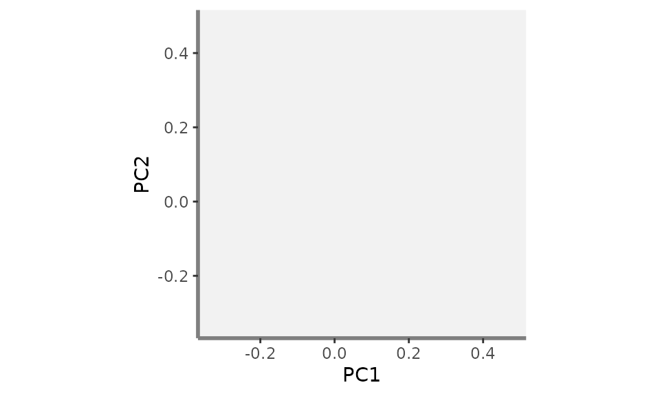

  

#### b - Add the global convex-hull

  

The convex-hull shaping the global pool of species is then added to the
background plot. Species can be plotted with a minimal shape and color
or even not displayed (what we will do here) thus when plotting species
from wanted assemblages, there is not too much information on the graph.
There are two steps: first, retrieving the coordinates of species being
vertices along the two studied functional axes and second, add species
from the global pool to the background plot (called `plot_k` in this
tutorial):

  

**Step 1: vertices** Realised using the [vertices()
function](https://cmlmagneville.github.io/mFD/reference/vertices.html)
which identifies species being vertices of the minimal convex-hull
enclosing a community. It needs three main inputs:

- sp_faxes_coord: the matrix of species coordinates in the chosen
  functional space. Here, as we are interested in PC1 and PC2, the
  `sp_faxes_coord` matrix only contains coordinates along PC1 and PC2.

- order_2D: TRUE/FALSE indicating whether vertices names are reordered
  so that they define a convex polygon in two dimensions which is
  convenient for plotting.

- check_input: same argument as many of the `mFD` functions allowing to
  have customized error messages and not R basic ones.

**USAGE** Retrieve vertices coordinates along PC1 and PC2

``` r
# Retrieve vertices coordinates along the two studied functional axes:
vert <- mFD::vertices(sp_faxes_coord = sp_faxes_coord_xy,  
                      order_2D = FALSE, 
                      check_input = TRUE)
```

  

**Step 2: Add global convex-hull of species** Realised using the
[pool.plot()
function](https://cmlmagneville.github.io/mFD/reference/vertices.html)
which plot all species from the global pool and the associated convex
hull with customized shape and colors for species and customised colours
and opacity for the convex-hull. Species being vertices can also be
plotted with a different shape or color. It needs three main inputs:

- ggplot_bg: the ggplot object created on the step before *ie* the plot
  of the background retrieved through the
  [background.plot()](https://cmlmagneville.github.io/mFD/reference/background.plot.html)
  function.

- sp_coord_2D: the matrix of species coordinates but with coordinates
  **only for the ais to plot** thus here only PC1 and PC2. It
  corresponds to the `sp_faxes_coord_xy` object created before.

- vertices_nD: a vector containing the name of species being vertices
  along the two studied dimensions. It correspond to the `vert` object
  created before. **We will here first show how to plot vertices with
  different shape/color. Yet, in order to have a clear plot with more
  than two convex-hulls (goal of this tutorial) we will then remove
  vertices shape and color by setting** `null` **to the** `vertices_nD`
  **argument**.

- arguments to customise species shape and colours: `color_pool`,
  `fill_pool`, `shape_pool` and `size_pool` arguments can be used. **We
  will here first show how to plot species with customised shape/color.
  Yet, in order to have a clear plot with more than two convex-hulls
  (goal of this tutorial) we will then not display species by setting**
  `NA` **to the** `color_pool` **argument**.

- arguments to customise vertices shape and colours: `color_vert`,
  `fill_vert`, `shape_vert` and `size_vert` arguments can be used. **We
  will here first show how to plot vertices with different shape/color.
  Yet, in order to have a clear plot with more than two convex-hulls
  (goal of this tutorial) we will then remove vertices shape and color
  by setting aestiteic arguments of vertices to** `NA`.

- arguments to customise the convex hull of the global pool: `color_ch`,
  `fill_ch` and `alpha_ch` arguments can be used.

**USAGE** Add convex-hull, species & vertices from the global pool (plot
not used in the workflow of this tutorial because it is too complex to
be able to easily read the final plot with more than two convex-hulls)

``` r
plot_sp_vert <- mFD::pool.plot(ggplot_bg = plot_k,
                             sp_coord2D = sp_faxes_coord_xy,
                             vertices_nD = vert,
                             plot_pool = TRUE,
                             color_pool = "black",
                             fill_pool = NA,
                             alpha_ch =  0.8,
                             color_ch = NA,
                             fill_ch = "white",
                             shape_pool = 3,
                             size_pool = 0.8,
                             shape_vert = 16,
                             size_vert = 1,
                             color_vert = "green",
                             fill_vert = "green")
plot_sp_vert
```

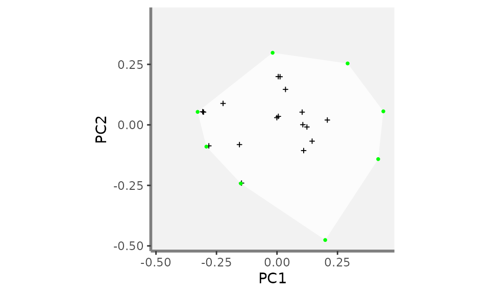

**USAGE** Let’s continue the workflow on how to plot more than two
convex-hulls! Thus remove species otherwise the final plot will be
difficult to read ;)

``` r
plot_k <- mFD::pool.plot(ggplot_bg = plot_k,
                             sp_coord2D = sp_faxes_coord_xy,
                             vertices_nD = vert,
                             plot_pool = FALSE,
                             color_pool = NA,
                             fill_pool = NA,
                             alpha_ch =  0.8,
                             color_ch = "white",
                             fill_ch = "white",
                             shape_pool = NA,
                             size_pool = NA,
                             shape_vert = NA,
                             size_vert = NA,
                             color_vert = NA,
                             fill_vert = NA)
plot_k
```

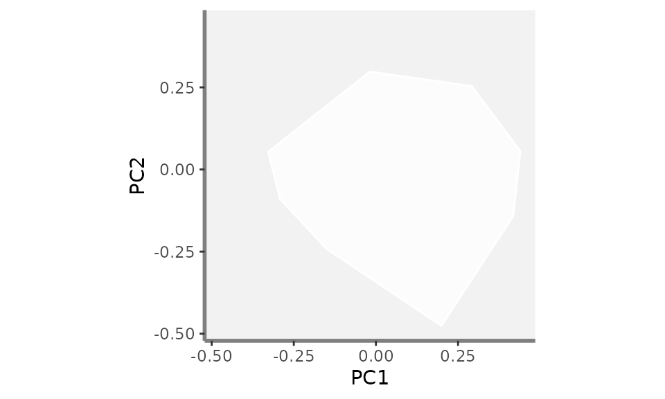

  

#### c - Add the convex-hulls and species of the wanted assemblages

  

Convex-hulls from the wanted assemblages can then be added to the
`plot_k` object which now contains the background and the convex-hull
from the global pool of species. **Here, we will plot three assemblages:
basket 1, basket 4 and basket 10 with different colors** using the
[fric.plot()
function](https://cmlmagneville.github.io/mFD/reference/fric.plot.html).
You can play with colors and opacities of each convex-hull so the graph
is easy to read and convex-hulls are easily distinguisable.

  

**Step 1: Get the coordinates of species of the assemblages to plot**
Realised using the
[sp.filter()](https://cmlmagneville.github.io/mFD/reference/sp.filter.html)
and the
[vertices()](https://cmlmagneville.github.io/mFD/reference/vertices.html)
functions to first retrieve the coordinates of species belonging to the
assemblages to plot and then the names of species being vertices.

**USAGE** Retrieve the coordinates of species belonging to basket_1,
basket_6 and basket_10:

``` r
# basket_1:
## filter species from basket_1:
sp_filter_basket1 <- mFD::sp.filter(asb_nm = c("basket_1"),
                            sp_faxes_coord = sp_faxes_coord_xy,
                                  asb_sp_w = baskets_fruits_weights)
## get species coordinates (basket_1):
sp_faxes_coord_basket1 <- sp_filter_basket1$`species coordinates`

  
# basket_6:
## filter species from basket_6:
sp_filter_basket6 <- mFD::sp.filter(asb_nm = c("basket_6"),
                            sp_faxes_coord = sp_faxes_coord_xy,
                                  asb_sp_w = baskets_fruits_weights)
## get species coordinates (basket_6):
sp_faxes_coord_basket6 <- sp_filter_basket6$`species coordinates`


# basket_10:
## filter species from basket_10:
sp_filter_basket10 <- mFD::sp.filter(asb_nm = c("basket_10"),
                            sp_faxes_coord = sp_faxes_coord_xy,
                                  asb_sp_w = baskets_fruits_weights)
## get species coordinates (basket_10):
sp_faxes_coord_basket10 <- sp_filter_basket10$`species coordinates`
```

  

Let’s have a look at the coordinates of species from `basket_1`: note
that we are still working with the coordinates along the two studied
functional axis PC1 and PC2

``` r
sp_faxes_coord_basket1
```

    ##                         PC1           PC2
    ## apple          0.0055715265  0.0350421604
    ## banana         0.4180172546 -0.1414728845
    ## cherry        -0.0180809780  0.2978695529
    ## lemon          0.1067949113  0.0007714157
    ## melon         -0.1493941692 -0.2420723462
    ## passion_fruit  0.1101264243 -0.1062790540
    ## pear          -0.0005886084  0.0297927029
    ## strawberry    -0.2917242495 -0.0898440618

  

**USAGE** Retrieve the names of species being vertices of basket_1,
basket_6 and basket_10:

``` r
# basket_1:
vert_nm_basket1 <- mFD::vertices(sp_faxes_coord = sp_faxes_coord_basket1,
                                       order_2D = TRUE, 
                                    check_input = TRUE)

# basket_6:
vert_nm_basket6 <- mFD::vertices(sp_faxes_coord = sp_faxes_coord_basket6,
                                       order_2D = TRUE, 
                                    check_input = TRUE)

# basket_10:
vert_nm_basket10 <- mFD::vertices(sp_faxes_coord = sp_faxes_coord_basket10,
                                       order_2D = TRUE, 
                                    check_input = TRUE)
```

  

**Step 2: Adding assemblages convex_hulls and species** Realised using
the [fric.plot()
function](https://cmlmagneville.github.io/mFD/reference/fric.plot.html).
This function has a lot of argument to customise the plot and play with
colours, shapes and opacity. Its main inputs are:

- plot_k: the ggplot object created on the steps before *ie* the plot of
  the background retrieved through the
  [background.plot()](https://cmlmagneville.github.io/mFD/reference/background.plot.html)
  function with the global convex hull added through the [pool.plot()
  function](https://cmlmagneville.github.io/mFD/reference/vertices.html).

- asb_sp_coord_2D: a list containing the coordinates of species
  belonging to each assemblage to plot across the two functional ais
  studied (here PC1 and PC2). **Note:** each element of this list
  reflects a given assemblage and each element must be nammed after the
  assemblage.

- asb_vertices_nD: a list containing a list (with names as in
  asb_sp_coord2D) of vectors with names of species being vertices in n
  dimensions. **Note:** each element of this list reflects a given
  assemblage and each element must be nammed after the assemblage.

- plot_sp: a TRUE/FALSE value indicating whether species from the
  studied assemblages must be plotted. If `TRUE`, then the arguments
  `shape_sp`, `size_sp`, `color_sp` and `fill_sp` help to customise
  species shapes/sizes/colours and the arguments `shape_vert`,
  `size_vert`, `color_vert` and `fill_vert` help to customise vertices.
  For shape/size/colour arguments, each element of the input list
  reflects a given assemblage and each element must be nammed after the
  assemblage *see the function help for more information*

- color_ch, fill_ch and alpha_ch: are lists containing colors and
  opacity values to caracterise each **c**onvex-**h**ull of the studied
  assemblage. **Note:** each element of these lists reflects a given
  assemblage and each element must be nammed after the assemblage **and
  the order in which each assemblage is given must reflect the same
  order than the asb_sp_coord_2D order**. Can be set up to `NA` if no
  colors are to be plotted.

**USAGE** Add the convex-hulls of the three studied assemblages: only
convex hulls with transparent surroundings, no species plotted

``` r
plot_try <- mFD::fric.plot(ggplot_bg = plot_k,
                    asb_sp_coord2D = list("basket_1" = sp_faxes_coord_basket1,
                                          "basket_6" = sp_faxes_coord_basket6,
                                          "basket_10" = sp_faxes_coord_basket10),
                   asb_vertices_nD = list("basket_1" = vert_nm_basket1,
                                          "basket_6" = vert_nm_basket6,
                                          "basket_10" = vert_nm_basket10),
                   
                           plot_sp = FALSE,
                   
                          color_ch = NA,
                           fill_ch = c("basket_1" = "#1c9099",
                                       "basket_6" = "#67a9cf",
                                       "basket_10" = "#d0d1e6"),
                             alpha_ch = c("basket_1" = 0.4,
                                       "basket_6" = 0.4,
                                       "basket_10" = 0.4),
                   
                             shape_sp = NA,
                             size_sp = NA,
                             color_sp = NA,
                             fill_sp = NA,
                   
                             shape_vert = NA,
                             size_vert = NA,
                             color_vert = NA,
                             fill_vert = NA)
plot_try
```


**USAGE** Add the convex-hulls of the three studied assemblages: only
convex hulls with coloured surroundings, no species plotted

``` r
plot_try <- mFD::fric.plot(ggplot_bg = plot_k,
                    asb_sp_coord2D = list("basket_1" = sp_faxes_coord_basket1,
                                          "basket_6" = sp_faxes_coord_basket6,
                                          "basket_10" = sp_faxes_coord_basket10),
                   asb_vertices_nD = list("basket_1" = vert_nm_basket1,
                                          "basket_6" = vert_nm_basket6,
                                          "basket_10" = vert_nm_basket10),
                   
                           plot_sp = FALSE,
                   
                          color_ch = c("basket_1" = "#7a0177",
                                       "basket_6" = "#c51b8a",
                                       "basket_10" = "#fa9fb5"),
                           fill_ch = c("basket_1" = "#1c9099",
                                       "basket_6" = "#67a9cf",
                                       "basket_10" = "#d0d1e6"),
                             alpha_ch = c("basket_1" = 0.4,
                                       "basket_6" = 0.4,
                                       "basket_10" = 0.4),
                   
                             shape_sp = NA,
                             size_sp = NA,
                             color_sp = NA,
                             fill_sp = NA,
                   
                             shape_vert = NA,
                             size_vert = NA,
                             color_vert = NA,
                             fill_vert = NA)
plot_try
```

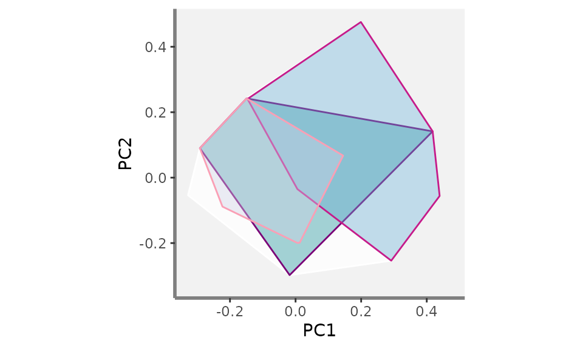

**USAGE** Add the convex-hulls of the three studied assemblages: only
convex hulls with transparent surroundings, species plotted but with no
differences between non-vertices and vertices species

``` r
plot_try <- mFD::fric.plot(ggplot_bg = plot_k,
                    asb_sp_coord2D = list("basket_1" = sp_faxes_coord_basket1,
                                          "basket_6" = sp_faxes_coord_basket6,
                                          "basket_10" = sp_faxes_coord_basket10),
                   asb_vertices_nD = list("basket_1" = vert_nm_basket1,
                                          "basket_6" = vert_nm_basket6,
                                          "basket_10" = vert_nm_basket10),
                   
                           plot_sp = TRUE,
                   
                          color_ch = NA,
                           fill_ch = c("basket_1" = "#1c9099",
                                       "basket_6" = "#67a9cf",
                                       "basket_10" = "#d0d1e6"),
                             alpha_ch = c("basket_1" = 0.4,
                                       "basket_6" = 0.4,
                                       "basket_10" = 0.4),
                   
                             shape_sp = c("basket_1" = 21,
                                       "basket_6" = 22,
                                       "basket_10" = 24),
                             size_sp = c("basket_1" = 2,
                                       "basket_6" = 2,
                                       "basket_10" = 2),
                             color_sp = c("basket_1" = "#1c9099",
                                       "basket_6" = "#67a9cf",
                                       "basket_10" = "#d0d1e6"),
                             fill_sp = c("basket_1" = "#1c9099",
                                       "basket_6" = "#67a9cf",
                                       "basket_10" = "#d0d1e6"),
                   
                             shape_vert = c("basket_1" = 21,
                                            "basket_6" = 22,
                                           "basket_10" = 24),
                             size_vert = c("basket_1" = 2,
                                           "basket_6" = 2,
                                          "basket_10" = 2),
                             color_vert = c("basket_1" = "#1c9099",
                                            "basket_6" = "#67a9cf",
                                           "basket_10" = "#d0d1e6"),
                             fill_vert = c("basket_1" = "#1c9099",
                                           "basket_6" = "#67a9cf",
                                          "basket_10" = "#d0d1e6"))
plot_try
```

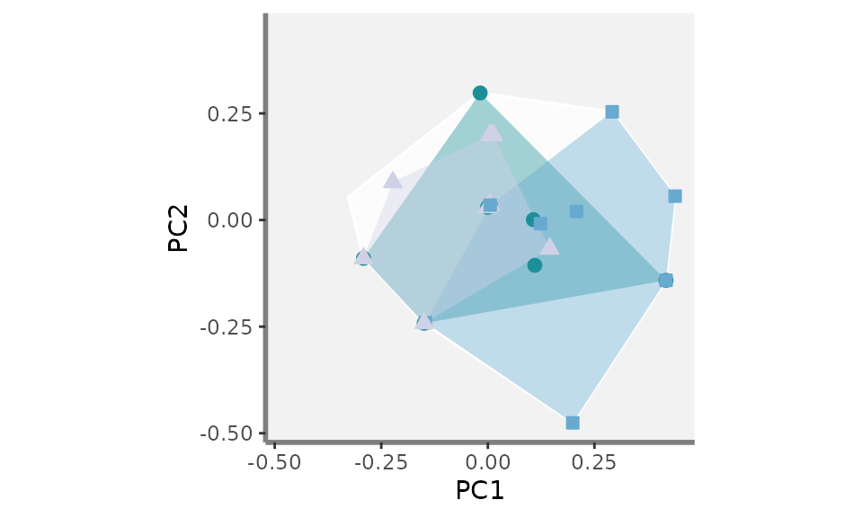

**USAGE** Add the convex-hulls of the three studied assemblages: only
convex hulls with transparent surroundings, species plotted but with
different colour between non-vertices and vertices species

``` r
plot_try <- mFD::fric.plot(ggplot_bg = plot_k,
                    asb_sp_coord2D = list("basket_1" = sp_faxes_coord_basket1,
                                          "basket_6" = sp_faxes_coord_basket6,
                                          "basket_10" = sp_faxes_coord_basket10),
                   asb_vertices_nD = list("basket_1" = vert_nm_basket1,
                                          "basket_6" = vert_nm_basket6,
                                          "basket_10" = vert_nm_basket10),
                   
                           plot_sp = TRUE,
                   
                          color_ch = NA,
                           fill_ch = c("basket_1" = "#1c9099",
                                       "basket_6" = "#67a9cf",
                                       "basket_10" = "#d0d1e6"),
                             alpha_ch = c("basket_1" = 0.4,
                                       "basket_6" = 0.4,
                                       "basket_10" = 0.4),
                   
                             shape_sp = c("basket_1" = 21,
                                       "basket_6" = 22,
                                       "basket_10" = 24),
                             size_sp = c("basket_1" = 2,
                                       "basket_6" = 2,
                                       "basket_10" = 2),
                             color_sp = c("basket_1" = "#1c9099",
                                       "basket_6" = "#67a9cf",
                                       "basket_10" = "#d0d1e6"),
                             fill_sp = c("basket_1" = "#1c9099",
                                       "basket_6" = "#67a9cf",
                                       "basket_10" = "#d0d1e6"),
                   
                             shape_vert = c("basket_1" = 21,
                                            "basket_6" = 22,
                                           "basket_10" = 24),
                             size_vert = c("basket_1" = 2,
                                           "basket_6" = 2,
                                          "basket_10" = 2),
                             color_vert = c("basket_1" = "#7a0177",
                                            "basket_6" = "#c51b8a",
                                           "basket_10" = "#fa9fb5"),
                             fill_vert = c("basket_1" = "#7a0177",
                                            "basket_6" = "#c51b8a",
                                           "basket_10" = "#fa9fb5"))
plot_try
```

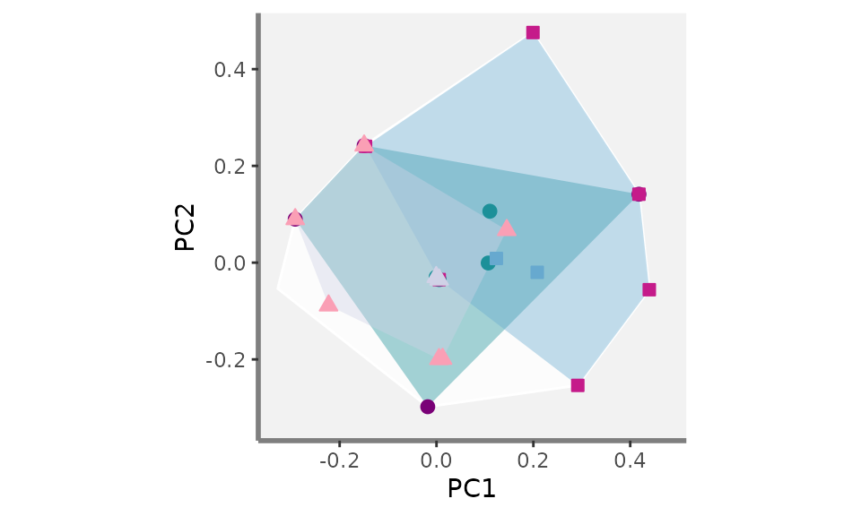

  

Now that we have seen the basic workflow of how to add graph components
with only two functional axis using the `mFD` functions which relies on
the `ggplot2` package, let’s compute as many graph as wanted! ;)

  

### Plotting functional convex-hulls for more than two assemblages for several pair of axis

  

For this part, we will shamelessly use a `for` loop as follow:

**USAGE** Structure of the loop to compute as many FRic plots as wanted
(combination of functional axes): here plots for PC1, PC2, PC3 and PC4

``` r
####### Preliminary steps:

## Compute the range of functional axes:
range_sp_coord  <- range(sp_faxes_coord_fruits)

## Based on the range of species coordinates values, compute a nice range ...
## ... for functional axes:
range_faxes <- range_sp_coord +
    c(-1, 1) * (range_sp_coord[2] - range_sp_coord[1]) * 0.05


####### Create a list that will contains plots for each combination of axis:
plot_FRic <- list()

####### Compute all the combiantion we can get and the number of plots
axes_plot <- utils::combn(c("PC1", "PC2", "PC3", "PC4"), 2)
plot_nb   <- ncol(axes_plot)


######## Loop on all pairs of axes:
# for each combinaison of two axis:
for (k in (1:plot_nb)) {

    # get names of axes to plot:
    xy_k <- axes_plot[1:2, k]
    
    
    ####### Steps previously showed
    
    # a - Background:
    # get species coordinates along the two studied axes:
    sp_faxes_coord_xy <- sp_faxes_coord_fruits[, xy_k]

    # Plot background with grey backrgound:
    plot_k <- mFD::background.plot(range_faxes = range_faxes, 
                               faxes_nm = c(xy_k[1], xy_k[2]),
                               color_bg = "grey95")
    
    
    # b - Global convex-hull:
    # Retrieve vertices coordinates along the two studied functional axes:
    vert <- mFD::vertices(sp_faxes_coord = sp_faxes_coord_xy,  
                      order_2D = FALSE, 
                      check_input = TRUE)
    
    plot_k <- mFD::pool.plot(ggplot_bg = plot_k,
                             sp_coord2D = sp_faxes_coord_xy,
                             vertices_nD = vert,
                             plot_pool = FALSE,
                             color_pool = NA,
                             fill_pool = NA,
                             alpha_ch =  0.8,
                             color_ch = "white",
                             fill_ch = "white",
                             shape_pool = NA,
                             size_pool = NA,
                             shape_vert = NA,
                             size_vert = NA,
                             color_vert = NA,
                             fill_vert = NA)
    
    
    # c - Assemblages convex-hulls and species:
    
    # Step 1: Species coordinates:
    # basket_1:
    ## filter species from basket_1:
    sp_filter_basket1 <- mFD::sp.filter(asb_nm = c("basket_1"),
                                sp_faxes_coord = sp_faxes_coord_xy,
                                      asb_sp_w = baskets_fruits_weights)
    ## get species coordinates (basket_1):
    sp_faxes_coord_basket1 <- sp_filter_basket1$`species coordinates`
    
      
    # basket_6:
    ## filter species from basket_6:
    sp_filter_basket6 <- mFD::sp.filter(asb_nm = c("basket_6"),
                                sp_faxes_coord = sp_faxes_coord_xy,
                                      asb_sp_w = baskets_fruits_weights)
    ## get species coordinates (basket_6):
    sp_faxes_coord_basket6 <- sp_filter_basket6$`species coordinates`
    
    
    # basket_10:
    ## filter species from basket_10:
    sp_filter_basket10 <- mFD::sp.filter(asb_nm = c("basket_10"),
                                sp_faxes_coord = sp_faxes_coord_xy,
                                      asb_sp_w = baskets_fruits_weights)
    ## get species coordinates (basket_10):
    sp_faxes_coord_basket10 <- sp_filter_basket10$`species coordinates`
    
    
    # Step 1 follow-up Vertices names:
    # basket_1:
    vert_nm_basket1 <- mFD::vertices(sp_faxes_coord = sp_faxes_coord_basket1,
                                     order_2D = TRUE, 
                                     check_input = TRUE)
    
    # basket_6:
    vert_nm_basket6 <- mFD::vertices(sp_faxes_coord = sp_faxes_coord_basket6,
                                     order_2D = TRUE, 
                                     check_input = TRUE)
    
    # basket_10:
    vert_nm_basket10 <- mFD::vertices(sp_faxes_coord = sp_faxes_coord_basket10,
                                      order_2D = TRUE, 
                                      check_input = TRUE)
    
    
    # Step 2: plot convex-hulls and species of studied assemblages:
    plot_k <- mFD::fric.plot(ggplot_bg = plot_k,
                    asb_sp_coord2D = list("basket_1" = sp_faxes_coord_basket1,
                                          "basket_6" = sp_faxes_coord_basket6,
                                          "basket_10" = sp_faxes_coord_basket10),
                   asb_vertices_nD = list("basket_1" = vert_nm_basket1,
                                          "basket_6" = vert_nm_basket6,
                                          "basket_10" = vert_nm_basket10),
                   
                           plot_sp = TRUE,
                   
                          color_ch = NA,
                           fill_ch = c("basket_1" = "#1c9099",
                                       "basket_6" = "#67a9cf",
                                       "basket_10" = "#d0d1e6"),
                             alpha_ch = c("basket_1" = 0.4,
                                       "basket_6" = 0.4,
                                       "basket_10" = 0.4),
                   
                             shape_sp = c("basket_1" = 21,
                                       "basket_6" = 22,
                                       "basket_10" = 24),
                             size_sp = c("basket_1" = 2,
                                       "basket_6" = 2,
                                       "basket_10" = 2),
                             color_sp = c("basket_1" = "#1c9099",
                                       "basket_6" = "#67a9cf",
                                       "basket_10" = "#d0d1e6"),
                             fill_sp = c("basket_1" = "#1c9099",
                                       "basket_6" = "#67a9cf",
                                       "basket_10" = "#d0d1e6"),
                   
                             shape_vert = c("basket_1" = 21,
                                            "basket_6" = 22,
                                           "basket_10" = 24),
                             size_vert = c("basket_1" = 2,
                                           "basket_6" = 2,
                                          "basket_10" = 2),
                             color_vert = c("basket_1" = "#1c9099",
                                            "basket_6" = "#67a9cf",
                                           "basket_10" = "#d0d1e6"),
                             fill_vert = c("basket_1" = "#1c9099",
                                           "basket_6" = "#67a9cf",
                                          "basket_10" = "#d0d1e6"))
    
    ####### Save the plot on the plot list:
    plot_FRic[[k]] <- plot_k
    
}
```

Let’s now have a look at the `plot_FRic` list which contains the FRic
plots for the three studied assemblages (basket_1, basket_6 and
basket_10). It contains as many element as there are combination of two
axis with the four studied axis:

``` r
plot_FRic
```

    ## [[1]]


    ## 
    ## [[2]]

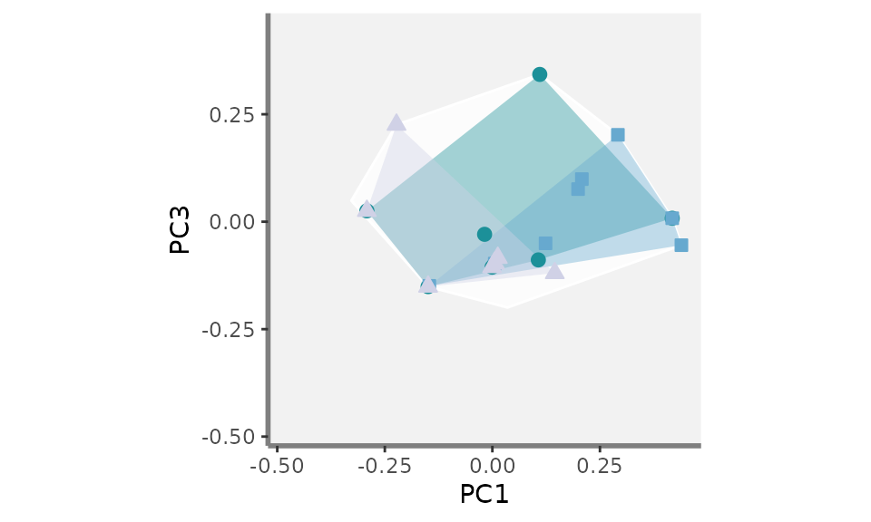

    ## 
    ## [[3]]

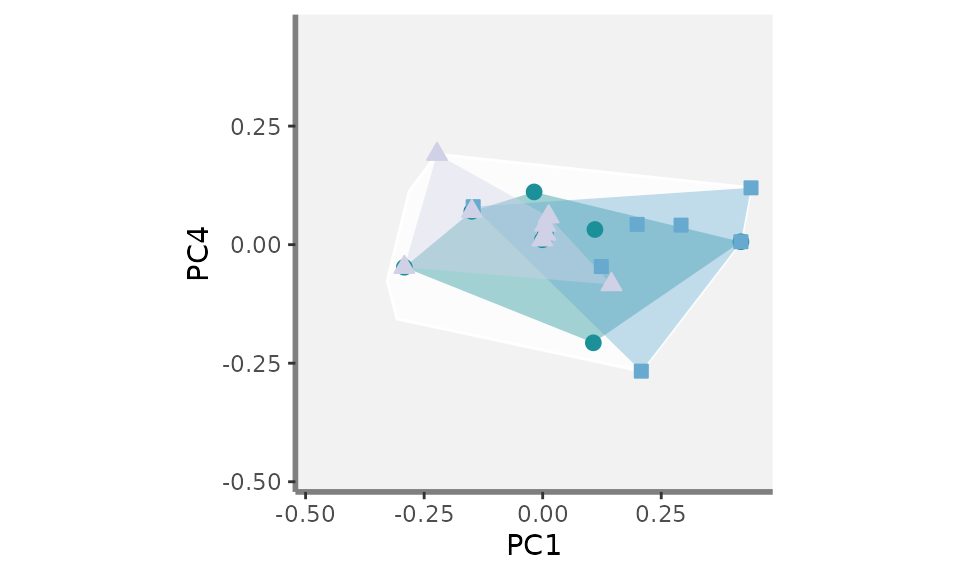

    ## 
    ## [[4]]

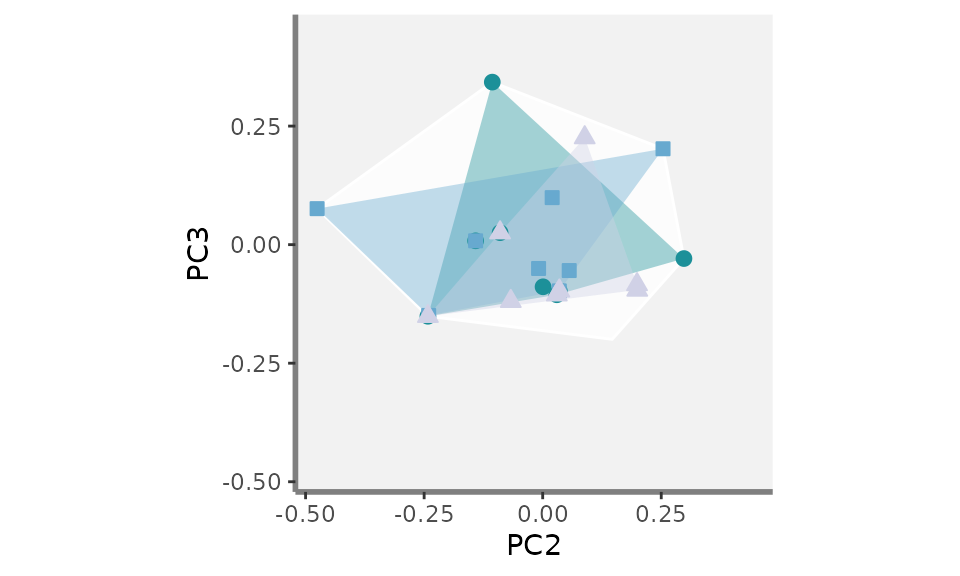

    ## 
    ## [[5]]

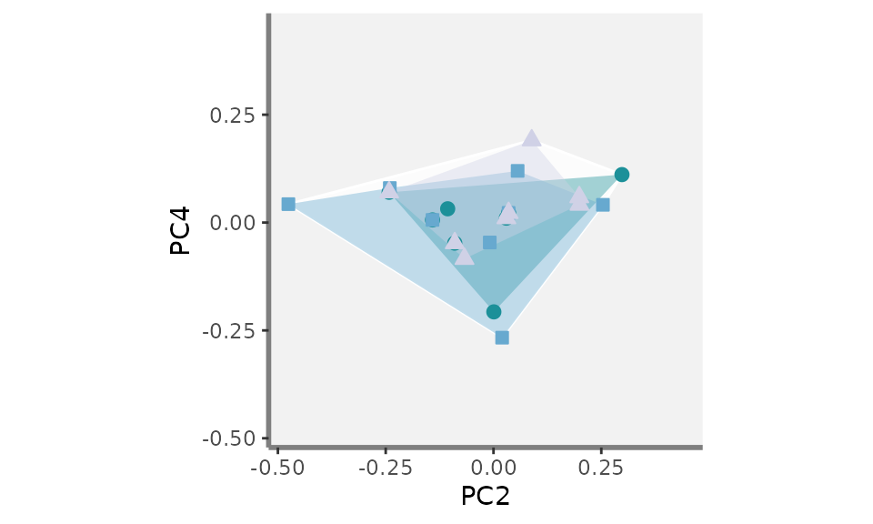

    ## 
    ## [[6]]

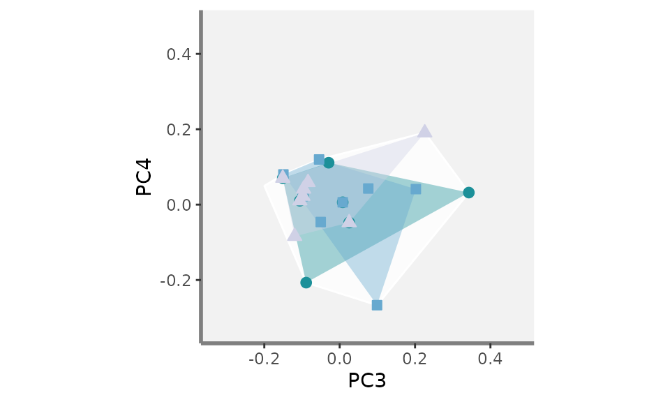

  

### Gathering plots together using the `patchwork` package

  

We are now close to the final graph! Using the [patchwork
package](https://patchwork.data-imaginist.com/), we then combine the
plots altogether:

**USAGE** Combine Fric plots into a single graph using the patchwork
package

``` r
patchwork_FRic <- (plot_FRic[[1]] + patchwork::plot_spacer() + patchwork::plot_spacer() +
                  plot_FRic[[2]] + plot_FRic[[4]] + patchwork::plot_spacer() +
                              plot_FRic[[3]] + plot_FRic[[5]] + plot_FRic[[6]]) +
      patchwork::plot_layout(byrow = TRUE, heights = rep(1, 3),
                             widths = rep(1, 3), ncol = 3, nrow = 3,
                             guides = "collect")
patchwork_FRic
```

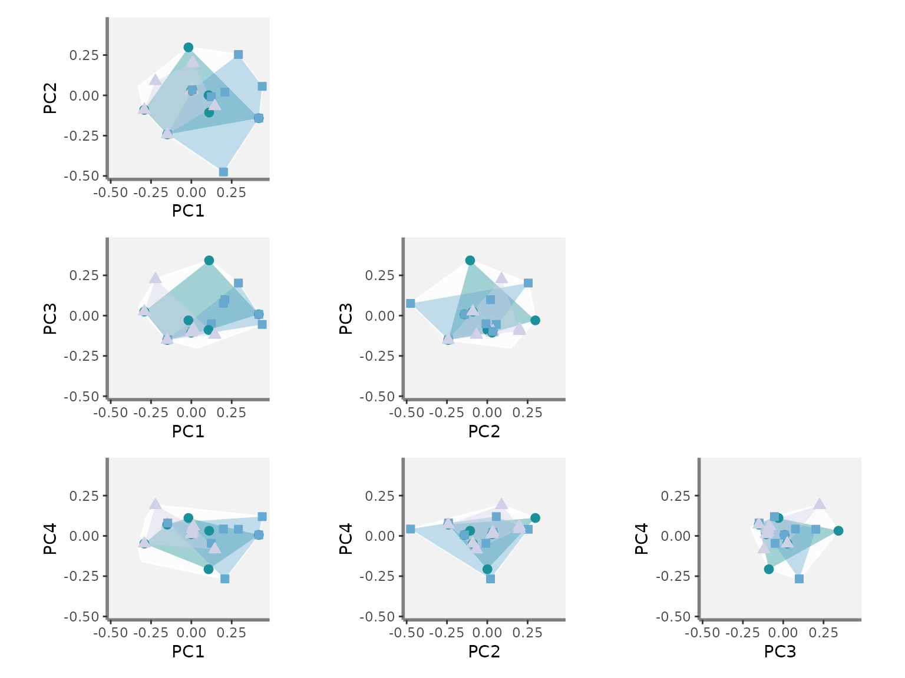

  

You can now play with colours, shapes and add as many assemblages as
wanted!

  

## Plotting species differently according to one trait value (coming soon…)

  
