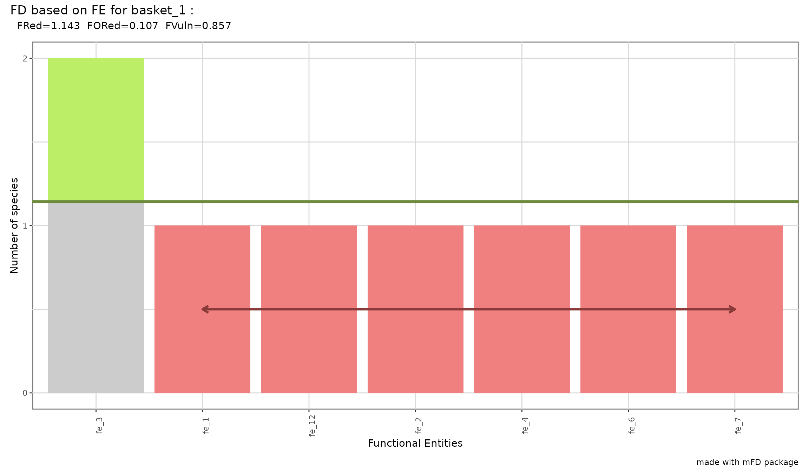

# How to Deal With Functional Entities

  

## 1. Why Functional Entities (FEs)?

  

`mFD` allows gathering species into **functional entities (FEs)** *i.e.*
**groups of species with same trait values** when many species are
described with a few categorical or ordinal traits. It is particularly
useful when using large datasets with “functionally similar” species.
FEs also allow to understand the links between functional diversity and
ecological processes as redundant species that are supposed to have
similar ecological roles are clustered in this method.

  

## 2. Tutorial’s data

  

**DATA** The dataset used to illustrate this tutorial is a **fruits
dataset** based on 25 types of fruits (*i.e.* species) distributed in 10
fruit baskets (*i.e.* assemblages). Each fruit is characterized by six
trait values summarized in the following table:

  

| Trait name | Trait measurement | Trait type  | Number of classes |      Classes code      | Unit |
|:----------:|:-----------------:|:-----------:|:-----------------:|:----------------------:|:----:|
|    Size    | Maximal diameter  |   Ordinal   |         5         | small ; medium ; large |  cm  |
|   Plant    |    Growth form    | Categorical |         4         |    tree ; not tree     |  NA  |
|  Climate   |  Climatic niche   |   Ordinal   |         3         |  temperate ; tropical  |  NA  |
|    Seed    |     Seed type     |   Ordinal   |         3         |    none ; pip ; pit    |  NA  |

  

**NOTE** We reduced the dataset used in [mFD General
Workflow](https://cmlmagneville.github.io/mFD/articles/mFD_general_workflow.html)
to only keep ordinal and categorical traits. Categorical traits are
restrained to 2 or 3 modalities per traits to limit the number of unique
combinations.

  

The following data frame and matrix are needed:

- the data frame summarizing traits values for each species called
  *fruits_traits* data frame in this tutorial:

  

``` r
data("fruits_traits", package = "mFD")

fruits_traits <- fruits_traits[ , 1:4]      # only keep the first 4 traits to illustrate FEs

# Decrease the number of modalities per trait for convenience ...
# ... (to have less unique combinations of trait values):

# Size grouped into only 3 categories:
fruits_traits[ , "Size"] <- as.character(fruits_traits[ , "Size"])

fruits_traits[which(fruits_traits[ , "Size"] %in% c("0-1cm", "1-3cm", "3-5cm")), "Size"] <- "small"
fruits_traits[which(fruits_traits[ , "Size"] == "5-10cm"), "Size"]  <- "medium"
fruits_traits[which(fruits_traits[ , "Size"] == "10-20cm"), "Size"] <- "large"

fruits_traits[ , "Size"] <- factor(fruits_traits[, "Size"], levels = c("small", "medium", "large"), ordered = TRUE)

# Plant type grouped into only 2 categories:
fruits_traits[ , "Plant"] <- as.character(fruits_traits[, "Plant"])

fruits_traits[which(fruits_traits[ , "Plant"] != "tree"), "Plant"] <- "Not_tree"
fruits_traits[ , "Plant"] <- factor(fruits_traits[ , "Plant"], levels = c("Not_tree", "tree"), ordered = TRUE)

# Plant Origin grouped into only 2 categories:
fruits_traits[ , "Climate"] <- as.character(fruits_traits[ , "Climate"])

fruits_traits[which(fruits_traits[ , "Climate"] != "temperate"), "Climate"] <- "tropical"
fruits_traits[ , "Climate"] <- factor(fruits_traits[, "Climate"], levels = c("temperate", "tropical"), ordered = TRUE)

# Display the table:
knitr::kable(head(fruits_traits), caption = "Species x traits dataframe based on *fruits* dataset")
```

|            | Size   | Plant    | Climate   | Seed |
|:-----------|:-------|:---------|:----------|:-----|
| apple      | medium | tree     | temperate | pip  |
| apricot    | small  | tree     | temperate | pit  |
| banana     | large  | tree     | tropical  | none |
| currant    | small  | Not_tree | temperate | pip  |
| blackberry | small  | Not_tree | temperate | pip  |
| blueberry  | small  | Not_tree | temperate | pip  |

Species x traits dataframe based on *fruits* dataset

  

- the matrix summarizing assemblages called *basket_fruits_weights* in
  this tutorial:

  

``` r
data("baskets_fruits_weights", package = "mFD")

knitr::kable(as.data.frame(baskets_fruits_weights[1:6, 1:6]), 
             caption = "Species x assemblages dataframe based on *fruits* dataset")
```

|          | apple | apricot | banana | currant | blackberry | blueberry |
|:---------|------:|--------:|-------:|--------:|-----------:|----------:|
| basket_1 |   400 |       0 |    100 |       0 |          0 |         0 |
| basket_2 |   200 |       0 |    400 |       0 |          0 |         0 |
| basket_3 |   200 |       0 |    500 |       0 |          0 |         0 |
| basket_4 |   300 |       0 |      0 |       0 |          0 |         0 |
| basket_5 |   200 |       0 |      0 |       0 |          0 |         0 |
| basket_6 |   100 |       0 |    200 |       0 |          0 |         0 |

Species x assemblages dataframe based on *fruits* dataset

  

- the data frame summarizing traits categories called
  *fruits_traits_cat* in this tutorial: (for details: [mFD General
  Workflow](https://cmlmagneville.github.io/mFD/articles/mFD_general_workflow.html))

  

``` r
data("fruits_traits_cat", package = "mFD")

# only keep traits 1 - 4:
fruits_traits_cat <- fruits_traits_cat[1:4, ]

knitr::kable(head(fruits_traits_cat), 
             caption = "Traits types based on *fruits & baskets* dataset")
```

| trait_name | trait_type | fuzzy_name |
|:-----------|:-----------|:-----------|
| Size       | O          | NA         |
| Plant      | N          | NA         |
| Climate    | O          | NA         |
| Seed       | O          | NA         |

Traits types based on *fruits & baskets* dataset

  

Using the
[`mFD::asb.sp.summary()`](https://cmlmagneville.github.io/mFD/reference/asb.sp.summary.md)
function, we can sum up the assemblages data and retrieve species
occurrence data:

  

``` r
# summarize species assemblages: 
asb_sp_fruits_summ <- mFD::asb.sp.summary(baskets_fruits_weights)

# retrieve species occurrences for the first 3 assemblages (fruits baskets):
head(asb_sp_fruits_summ$asb_sp_occ, 3)
```

    ##          apple apricot banana currant blackberry blueberry cherry grape
    ## basket_1     1       0      1       0          0         0      1     0
    ## basket_2     1       0      1       0          0         0      1     0
    ## basket_3     1       0      1       0          0         0      1     0
    ##          grapefruit kiwifruit lemon lime litchi mango melon orange
    ## basket_1          0         0     1    0      0     0     1      0
    ## basket_2          0         0     1    0      0     0     1      0
    ## basket_3          0         0     1    0      0     0     1      0
    ##          passion_fruit peach pear pineapple plum raspberry strawberry tangerine
    ## basket_1             1     0    1         0    0         0          1         0
    ## basket_2             1     0    1         0    0         0          1         0
    ## basket_3             1     0    1         0    0         0          1         0
    ##          water_melon
    ## basket_1           0
    ## basket_2           0
    ## basket_3           0

``` r
asb_sp_fruits_occ <- asb_sp_fruits_summ$"asb_sp_occ"
```

  

## 3. Gather species into FEs

  

`mFD` allows you to gather species into FEs using the
[`mFD::sp.to.fe()`](https://cmlmagneville.github.io/mFD/reference/sp.to.fe.md)
function. It uses the following arguments:

  

**USAGE**

``` r
mFD::sp.to.fe(
  sp_tr       = fruits_traits, 
  tr_cat      = fruits_traits_cat, 
  fe_nm_type  = "fe_rank", 
  check_input = TRUE) 
```

  

- *sp_tr* the data frame of species traits
- *tr_cat* the data frame summarizing traits categories
- *fe_nm_type* is a character string referring to the way FEs should be
  named: they can be named after their decreasing rank in term of number
  of species (*i.e. fe_1 is the one gathering most species*) (*fe_rank*)
  or they can be named after names of traits
- *check_input* is a logical value reflecting whether inputs should be
  checked or not. Possible error messages will thus be more
  understandable for the user than R error messages **NOTE**
  Recommendation: set it as `TRUE`

Let’s use this function with the *fruits dataset*:

  

``` r
sp_to_fe_fruits <- mFD::sp.to.fe(
  sp_tr       = fruits_traits, 
  tr_cat      = fruits_traits_cat, 
  fe_nm_type  = "fe_rank", 
  check_input = TRUE) 
```

  

[`mFD::sp.to.fe()`](https://cmlmagneville.github.io/mFD/reference/sp.to.fe.md)
returns:

- a vector containing FEs names:  

``` r
sp_to_fe_fruits$"fe_nm"
```

    ##  [1] "fe_1"  "fe_2"  "fe_3"  "fe_4"  "fe_5"  "fe_6"  "fe_7"  "fe_8"  "fe_9" 
    ## [10] "fe_10" "fe_11" "fe_12" "fe_13" "fe_14"

  

- a vector containing for each species, the FE it belongs to:  

``` r
sp_fe <- sp_to_fe_fruits$"sp_fe"
sp_fe
```

    ##         apple       apricot        banana       currant    blackberry 
    ##        "fe_3"        "fe_2"        "fe_7"        "fe_1"        "fe_1" 
    ##     blueberry        cherry         grape    grapefruit     kiwifruit 
    ##        "fe_1"        "fe_2"        "fe_1"        "fe_8"        "fe_9" 
    ##         lemon          lime        litchi         mango         melon 
    ##        "fe_4"        "fe_5"       "fe_10"       "fe_11"        "fe_6" 
    ##        orange passion_fruit         peach          pear     pineapple 
    ##        "fe_4"       "fe_12"       "fe_13"        "fe_3"       "fe_14" 
    ##          plum     raspberry    strawberry     tangerine   water_melon 
    ##        "fe_2"        "fe_1"        "fe_1"        "fe_5"        "fe_6"

  

- a data frame containing for FEs, the values of traits for each FE:

  

``` r
fe_tr <- sp_to_fe_fruits$"fe_tr"
fe_tr
```

    ##         Size    Plant   Climate Seed
    ## fe_1   small Not_tree temperate  pip
    ## fe_2   small     tree temperate  pit
    ## fe_3  medium     tree temperate  pip
    ## fe_4  medium     tree  tropical  pip
    ## fe_5   small     tree  tropical  pip
    ## fe_6   large Not_tree temperate  pip
    ## fe_7   large     tree  tropical none
    ## fe_8   large     tree  tropical  pip
    ## fe_9  medium Not_tree temperate  pip
    ## fe_10  small     tree  tropical  pit
    ## fe_11  large     tree  tropical  pit
    ## fe_12  small Not_tree  tropical  pip
    ## fe_13 medium     tree temperate  pit
    ## fe_14  large Not_tree  tropical none

  

- a vector containing the number of species per FE:

  

``` r
fe_nb_sp <- sp_to_fe_fruits$"fe_nb_sp"
fe_nb_sp
```

    ##  fe_1  fe_2  fe_3  fe_4  fe_5  fe_6  fe_7  fe_8  fe_9 fe_10 fe_11 fe_12 fe_13 
    ##     6     3     2     2     2     2     1     1     1     1     1     1     1 
    ## fe_14 
    ##     1

  

- a detailed list containing vectors or list with supplementary
  information about FEs:

  

``` r
sp_to_fe_fruits$"details_fe"
```

    ## $fe_codes
    ##                                                fe_1 
    ##  "SIZEsmall_PLANTnot_tree_CLIMATEtemperate_SEEDpip" 
    ##                                                fe_2 
    ##      "SIZEsmall_PLANTtree_CLIMATEtemperate_SEEDpit" 
    ##                                                fe_3 
    ##     "SIZEmedium_PLANTtree_CLIMATEtemperate_SEEDpip" 
    ##                                                fe_4 
    ##      "SIZEmedium_PLANTtree_CLIMATEtropical_SEEDpip" 
    ##                                                fe_5 
    ##       "SIZEsmall_PLANTtree_CLIMATEtropical_SEEDpip" 
    ##                                                fe_6 
    ##  "SIZElarge_PLANTnot_tree_CLIMATEtemperate_SEEDpip" 
    ##                                                fe_7 
    ##      "SIZElarge_PLANTtree_CLIMATEtropical_SEEDnone" 
    ##                                                fe_8 
    ##       "SIZElarge_PLANTtree_CLIMATEtropical_SEEDpip" 
    ##                                                fe_9 
    ## "SIZEmedium_PLANTnot_tree_CLIMATEtemperate_SEEDpip" 
    ##                                               fe_10 
    ##       "SIZEsmall_PLANTtree_CLIMATEtropical_SEEDpit" 
    ##                                               fe_11 
    ##       "SIZElarge_PLANTtree_CLIMATEtropical_SEEDpit" 
    ##                                               fe_12 
    ##   "SIZEsmall_PLANTnot_tree_CLIMATEtropical_SEEDpip" 
    ##                                               fe_13 
    ##     "SIZEmedium_PLANTtree_CLIMATEtemperate_SEEDpit" 
    ##                                               fe_14 
    ##  "SIZElarge_PLANTnot_tree_CLIMATEtropical_SEEDnone" 
    ## 
    ## $tr_uval
    ## $tr_uval$Size
    ## [1] "medium" "small"  "large" 
    ## 
    ## $tr_uval$Plant
    ## [1] "tree"     "Not_tree"
    ## 
    ## $tr_uval$Climate
    ## [1] "temperate" "tropical" 
    ## 
    ## $tr_uval$Seed
    ## [1] "pip"  "pit"  "none"
    ## 
    ## 
    ## $tr_nb_uval
    ##    Size   Plant Climate    Seed 
    ##       3       2       2       3 
    ## 
    ## $max_nb_fe
    ## [1] 36

  

## 4. Compute alpha and beta functional indices

  

Then based on the data frame containing the value of traits for each FE,
the workflow is the same as the one listed in [mFD General
Workflow](https://cmlmagneville.github.io/mFD/articles/mFD_general_workflow.html)
to compute functional trait based distance, multidimensional functional
space and associated plots and compute alpha and beta functional indices
(step 3 till the end). It will thus not be summed up in this tutorial.

  

`mFD` also allows to compute functional indices based on FEs following
the framework proposed in [Mouillot *et al.*
2014](https://www.pnas.org/doi/abs/10.1073/pnas.1317625111)) using the
[`mFD::alpha.fd.fe()`](https://cmlmagneville.github.io/mFD/reference/alpha.fd.fe.md)
function. It computes:

- *Functional Redundancy* that reflects the average number of species
  per FE
- *Functional Overredundancy* that reflects the proportion of species in
  excess in species-rich FE *ie* it represents the percentage of species
  that fill functional entities above the mean level of functional
  redundancy
- *Functional Vulnerability* that reflects the proportion of FE with
  only one species

  

[`mFD::alpha.fd.fe()`](https://cmlmagneville.github.io/mFD/reference/alpha.fd.fe.md)
function is used as follows:

  

**USAGE**

``` r
mFD::alpha.fd.fe(
  asb_sp_occ       = asb_sp_fruits_occ, 
  sp_to_fe         = sp_to_fe_fruits,
  ind_nm           = c("fred", "fored", "fvuln"),
  check_input      = TRUE,
  details_returned = TRUE) 
```

  

It takes as inputs:

- *asb_sp_occ* the assemblages-species occurrence dataframe retrieved on
  **step 2** with
  [`mFD::sp.tr.summary()`](https://cmlmagneville.github.io/mFD/reference/sp.tr.summary.md)
  function
- *sp_to_fe* a list with details of species clustering into FE from
  [`mFD::sp.to.fe()`](https://cmlmagneville.github.io/mFD/reference/sp.to.fe.md)
- *ind_nm* a vector referring to the indices to compute: *fred* for
  Functional Redundancy, *fored* for Functional Overredundancy and
  *fvuln* for Functional Vulnerability.
- *check_input* is a logical value reflecting whether inputs should be
  checked or not. Possible error messages will thus be more
  understandable for the user than R error messages **NOTE**
  Recommendation: set it as `TRUE`.
- *details_returned* is a logical value indicating whether the user
  wants to details_returned. Details are used in graphical functions and
  thus must be kept if the user want to have graphical outputs for the
  computed indices.

  

Let’s apply this function with the *fruits* dataset:

  

``` r
alpha_fd_fe_fruits <- mFD::alpha.fd.fe(
  asb_sp_occ       = asb_sp_fruits_occ, 
  sp_to_fe         = sp_to_fe_fruits,
  ind_nm           = c("fred", "fored", "fvuln"),
  check_input      = TRUE,
  details_returned = TRUE) 
```

  

This function returns a dataframe of indices values for each assemblage
and a detailed list containing a matrix gathering the number of species
per FE in each assemblage:

  

``` r
# dataframe with indices values for each assemblage:
alpha_fd_fe_fruits$"asb_fdfe"
```

    ##           nb_sp nb_fe     fred     fored     fvuln
    ## basket_1      8     7 1.142857 0.1071429 0.8571429
    ## basket_2      8     7 1.142857 0.1071429 0.8571429
    ## basket_3      8     7 1.142857 0.1071429 0.8571429
    ## basket_4      8     6 1.333333 0.1666667 0.6666667
    ## basket_5      8     6 1.333333 0.1666667 0.6666667
    ## basket_6      8     8 1.000000 0.0000000 1.0000000
    ## basket_7      8     8 1.000000 0.0000000 1.0000000
    ## basket_8      8     3 2.666667 0.4166667 0.6666667
    ## basket_9      8     3 2.666667 0.4166667 0.6666667
    ## basket_10     8     5 1.600000 0.1500000 0.4000000

``` r
# a matrix gathering the number of species per FE in each assemblage
alpha_fd_fe_fruits$"details_fdfe"
```

    ## $asb_fe_nbsp
    ##           fe_3 fe_2 fe_7 fe_1 fe_8 fe_9 fe_4 fe_5 fe_10 fe_11 fe_6 fe_12 fe_13
    ## basket_1     2    1    1    1    0    0    1    0     0     0    1     1     0
    ## basket_2     2    1    1    1    0    0    1    0     0     0    1     1     0
    ## basket_3     2    1    1    1    0    0    1    0     0     0    1     1     0
    ## basket_4     2    1    0    0    0    1    2    1     0     0    0     0     1
    ## basket_5     2    1    0    0    0    1    2    1     0     0    0     0     1
    ## basket_6     1    0    1    0    0    0    1    1     1     1    1     0     0
    ## basket_7     1    0    1    0    0    0    1    1     1     1    1     0     0
    ## basket_8     0    1    0    6    0    0    1    0     0     0    0     0     0
    ## basket_9     0    1    0    6    0    0    1    0     0     0    0     0     0
    ## basket_10    2    2    0    2    1    0    0    0     0     0    1     0     0
    ##           fe_14
    ## basket_1      0
    ## basket_2      0
    ## basket_3      0
    ## basket_4      0
    ## basket_5      0
    ## basket_6      1
    ## basket_7      1
    ## basket_8      0
    ## basket_9      0
    ## basket_10     0

  

## 5. Plot functional indices based on FEs

  

Then, it is possible to have a graphical representation of FE-based
indices for a given assemblage using the `mFD::alpha.fe.fd.plot()`
function:

  

**USAGE**

``` r
mFD::alpha.fd.fe.plot(
  alpha_fd_fe       = alpha_fd_fe_fruits,
  plot_asb_nm       = c("basket_1"),
  plot_ind_nm       = c("fred", "fored", "fvuln"),
  name_file         = NULL,
  color_fill_fored  = "darkolivegreen2",
  color_line_fred   = "darkolivegreen4",
  color_fill_bar    = "grey80",
  color_fill_fvuln  = "lightcoral",
  color_arrow_fvuln = "indianred4",
  size_line_fred    = 1.5,
  size_arrow_fvuln  = 1,
  check_input       = TRUE)
```

  

This function takes as inputs:

- *alpha_fe_fe_fruits* the output from the function
  [`mFD::alpha.fd.fe()`](https://cmlmagneville.github.io/mFD/reference/alpha.fd.fe.md)
  applied on assemblage of interest with `details_returned = TRUE`
- *plot_asb_nm* a vector containing the name of the assemblage to plot
- *plot_ind_nm* a vector containing the names of the indices to plot. It
  `fred` to plot functional redundancy (FRed), `fored` to plot
  functional over-redundancy (FOred) and/or `fvuln` to plot functional
  vulnerability (FVuln)
- *name_file* a character string with name of file to save the figure.
  If set to `NULL` the plot is only displayed
- inputs to personalize the plot (for details: see help file of the
  [`mFD::alpha.fd.fe.plot`](https://cmlmagneville.github.io/mFD/reference/alpha.fd.fe.plot.md))
- *check_input* is a logical value reflecting whether inputs should be
  checked or not. Possible error messages will thus be more
  understandable for the user than R error messages **NOTE**
  Recommendation: set it as `TRUE`

  

For the studied example, the plot looks as follows:

  

``` r
mFD::alpha.fd.fe.plot(
  alpha_fd_fe       = alpha_fd_fe_fruits,
  plot_asb_nm       = c("basket_1"),
  plot_ind_nm       = c("fred", "fored", "fvuln"),
  name_file         = NULL,
  color_fill_fored  = "darkolivegreen2",
  color_line_fred   = "darkolivegreen4",
  color_fill_bar    = "grey80",
  color_fill_fvuln  = "lightcoral",
  color_arrow_fvuln = "indianred4",
  size_line_fred    = 1.5,
  size_arrow_fvuln  = 1,
  check_input       = TRUE)
```

    ## Warning: The `size` argument of `element_rect()` is deprecated as of ggplot2 3.4.0.
    ## ℹ Please use the `linewidth` argument instead.
    ## ℹ The deprecated feature was likely used in the mFD package.
    ##   Please report the issue at <https://github.com/CmlMagneville/mFD/issues>.
    ## This warning is displayed once per session.
    ## Call `lifecycle::last_lifecycle_warnings()` to see where this warning was
    ## generated.

    ## Warning: The `size` argument of `element_line()` is deprecated as of ggplot2 3.4.0.
    ## ℹ Please use the `linewidth` argument instead.
    ## ℹ The deprecated feature was likely used in the mFD package.
    ##   Please report the issue at <https://github.com/CmlMagneville/mFD/issues>.
    ## This warning is displayed once per session.
    ## Call `lifecycle::last_lifecycle_warnings()` to see where this warning was
    ## generated.

    ## Warning: Using `size` aesthetic for lines was deprecated in ggplot2 3.4.0.
    ## ℹ Please use `linewidth` instead.
    ## ℹ The deprecated feature was likely used in the mFD package.
    ##   Please report the issue at <https://github.com/CmlMagneville/mFD/issues>.
    ## This warning is displayed once per session.
    ## Call `lifecycle::last_lifecycle_warnings()` to see where this warning was
    ## generated.

    ## Warning in ggplot2::geom_segment(ggplot2::aes(x = fe_vuln_k[1], y = 0.5, : All aesthetics have length 1, but the data has 7 rows.
    ## ℹ Please consider using `annotate()` or provide this layer with data containing
    ##   a single row.



  

All FE except “fe_3” contain only one species thus FRed and FVuln are
close to 1. Only “fe_3” has more species than the average number of
species thus the proportion of species in excess in FE richer than
average is quite low (FORed = 0.107).

  

## References

  

- Mouillot *et al.* (2014) Functional over-redundancy and high
  functional vulnerability in global fish faunas on tropical reefs.
  *PNAS*, **38**, 13757-13762.
