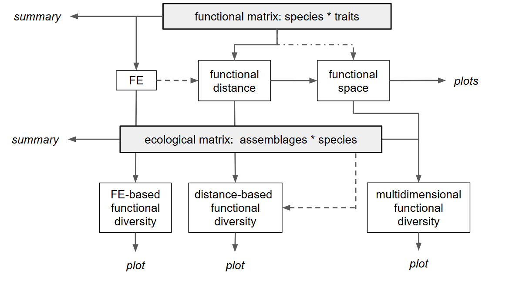

# About this tutorial

<br />

This tutorial describes the basic workflow showing how to compute step by step
functional diversity (FD) indices in a multidimensional space using `mFD`
package. Other functions are available and their uses are illustrated in others
tutorials.

🧩 The dataset used to illustrate this tutorial is a **fruits dataset** based on
25 types of fruits (*i.e.* species) distributed in 10 fruits baskets (*i.e.*
assemblages). Each fruit is characterized by five traits values summarized in the
following table:

<br />

| Trait name   | Trait measurement  | Trait type    | Number of classes   | Classes code                       | Unit   |
|:------------:|:------------------:|:-------------:|:-------------------:|:----------------------------------:|:------:|
| Size         | Maximal diameter   | Ordinal       | 5                   | 0-1 ; 1-3 ; 3-5 ; 5-10 ; 10-20     | cm     |
| Plant        | Growth form        | Categorical   | 4                   | tree; shrub; vine; forb            | NA     |
| Climate      | Climatic niche     | Ordinal       | 3                   | temperate ; subtropical ; tropical | NA     |
| Seed         | Seed type          | Ordinal       | 3                   | none ; pip ; pit                   | NA     |
| Sugar        | Sugar              | Continuous    | NA                  | NA                                 | g/kg   |


<br />

# Overview of the functional framework

<br />

The use of the `mFD` package is based on two datasets:

* a **data frame** summarizing traits values for each species called
`fruits_traits` in this tutorial


```{r}
# Load data:
data("fruits_traits", package = "mFD")

# Remove fuzzy traits in this tutorial:
fruits_traits <- fruits_traits[ , -c(6:8)]

# Display the table:
knitr::kable(head(fruits_traits),
             caption = "Species x traits data frame")
```

<br />

* a **matrix** summarizing species assemblages called `baskets_fruits_weights`
in this tutorial. Weights in this matrix can be occurrence data, abundance,
biomass, coverage, etc. The studied example works with biomass (*i.e.* grams of
a fruit in a basket) and this matrix looks as follows:


```{r}
# Load data:
data("baskets_fruits_weights", package = "mFD")

# Display the table:
knitr::kable(as.data.frame(baskets_fruits_weights[1:6, 1:6]), 
      centering = TRUE,
      caption = "Species x assemblages matrix based on the **fruits** dataset")

```

<br />

This tutorial will guide you through the main framework, illustrated in the
flowchart below, step by step.

<br />

```{r, echo = FALSE, out.width = "600px", fig.cap = "Basic framework of the mFD package", fig.align = 'center'}

```


<br />

# 1. Know your data

<br />

## 1.1. What types of traits am I using?

<br />

The first thing to do before starting analyses is to know your data. To do so,
you must be able to characterize the traits you are using (*i.e.* tell the
package what type of traits you are using). That is why `mFD` package needs a
data frame summarizing the type of each trait (*i.e.* each column of the
`fruits_traits` data frame).

👉 You need to set up a data frame with the same columns names as the below
example:


```{r}
# Load data:
data("fruits_traits_cat", package = "mFD")

# Remove fuzzy traits in this tutorial:
fruits_traits_cat <- fruits_traits_cat[-c(6:8), ]
# Thus remove the "fuzzy_name" column:
fruits_traits_cat <- fruits_traits_cat[ , -3]

# Display the table:
knitr::kable(head(fruits_traits_cat), 
             caption = "Traits types based on **fruits & baskets** dataset")
```


The **first column** contains **traits name**. The **second column** contains
**traits type** following this code:

* **N**: nominal trait (factor variable)
* **O**: ordinal traits (ordered variable)
* **C**: circular traits (integer values) (⚠️ circular traits can not be used in
`mFD` function used to compute functional distance but ok for summary function
and function to group species into Functional Entities)
* **Q**: quantitative traits (numeric values)
* **F**: fuzzy traits (described with several values defined in several columns
in the `fruits_traits` data frame)

You can add a **third column** **if** your dataset use fuzzy traits (then the
third column summarizes to which fuzzy trait belongs each column that refers to
a fuzzy trait) **or if** you want to give weight to each traits (then the third
column summarizes traits weights).

<br />

💡 The traits types dataframe thus has: **two columns** if **no fuzzy traits and
no weight given to traits** (columns names: `trait_name` and `trait_type`) ;
**three columns** if **fuzzy traits** (columns names:  `trait_name`,`trait_type`
and `fuzzy_name`) **or** if **no fuzzy traits and weight given to traits**
(columns names:  `trait_name`,`trait_type` and `trait_weight`)

<br />

## 1.2. Summarize my traits

<br />

The `mFD` package helps you to **summarize your data** using two distinct
functions: `mFD::sp.tr.summary()`  and `mFD::asb.sp.summary()`.

The function `mFD::sp.tr.summary()` summarizes the `fruits_traits` dataframe and
returns a list gathering several tables and lists:

* tables with summaries for non-fuzzy & fuzzy traits. **For non-fuzzy traits**,
the table sums up the number of species having each category for ordinal,
nominal and circular traits or minimum/first quartile/median/mean/third
quartile/maximum for continuous traits. **For fuzzy traits**, the table sums up
minimum/first quartile/median/mean/third quartile/maximum for each category of
each fuzzy trait.

* a list gathering traits types for non-fuzzy traits

* a list gathering modalities of non-continuous and non-fuzzy traits

<br />

**USAGE**

```{r}
# Species traits summary:
fruits_traits_summ <- mFD::sp.tr.summary(
                                 tr_cat     = fruits_traits_cat,   
                                 sp_tr      = fruits_traits, 
                                 stop_if_NA = TRUE)
```


```{r}
fruits_traits_summ$"tr_types"                     # Traits types 
```

<br />

```{r}
fruits_traits_summ$"mod_list"                     # Traits types for non-continuous and non-fuzzy traits
```


<br />

## 1.3. Summarize my assemblages

<br />

The second function helping you to summarize your data in the `mFD` package is
`mFD::asb.sp.summary()`. It summarizes the `baskets_fruits_weights` matrix and
returns a list gathering a matrix, a list and several vectors:

* a matrix of species occurrences

* a vector gathering species total biomass in all assemblages

* a vector gathering the total abundance/biomass per assemblage

* a vector gathering species richness per assemblage

* a list gathering species names present in each assemblage

<br />

**USAGE**

```{r}
# Summary of the assemblages * species dataframe:
asb_sp_fruits_summ <- mFD::asb.sp.summary(asb_sp_w = baskets_fruits_weights)
```

<br />

```{r}
head(asb_sp_fruits_summ$"asb_sp_occ", 3)        # Species occurrences for the first 3 assemblages
```

<br />

```{r}
asb_sp_fruits_summ$"sp_tot_w"              # Species total biomass in all assemblages
```

<br />

```{r}
asb_sp_fruits_summ$"asb_tot_w"             # Total biomass per assemblage
```

<br />

```{r}
asb_sp_fruits_summ$"asb_sp_richn"           # Species richness per assemblage
```

<br />

```{r}
asb_sp_fruits_summ$"asb_sp_nm"[[1]]             # Names of species present in the first assemblage
```

<br />

```{r, echo=FALSE}
asb_sp_fruits_occ <- asb_sp_fruits_summ$"asb_sp_occ"
```


<br />


# 2. Gathering species into functional entities

<br />

If you have many species described by few categorical and ordinal traits only,
then you might want to group them into Functional Entities (**FE**), *i.e*
**groups of species with same trait values when species are described with
categorical and/or ordinal traits**. It is particularly useful when using large
datasets with "functionally similar" species.


In this tutorial, this function is not illustrated (FE for the **fruits**
dataset have a single species) and thus functional diversity indices based on FE
are not computed. You can have a look to the
[Compute Functional Diversity Indices based on Functional Entities](https://cmlmagneville.github.io/mFD/articles/How_to_deal_with_Functional_Entities.html)
tutorial for further analysis using FE.


<br />

`mFD` also allows the user to compute FD indices based on Functional Entities
(FEs). Computed indices are **Functional Redundancy (FRed)**,
**Functional OverRedundancy (FORed)** and **Functional Vulnerability (FVuln)**
([Mouillot _et al._ 2014](https://www.pnas.org/content/111/38/13757.short)).
The **fruits & baskets** example does not allow to compute FEs, thus FD indices
based on FEs can not be compute. Check the [Compute functional diversity indices
based on Functional
Entities](https://cmlmagneville.github.io/mFD/articles/How_to_deal_with_Functional_Entities.html)
tutorial to see how to compute them.

<br />


# 3. Computing distances between species based on functional traits

<br />

The next step toward the computation of functional diversity indices is to
estimate functional traits-based distances between species in order to build the
functional space in which indices will be computed.

To compute trait-based distances, we will use the `mFD::funct.dist()` function
which includes the following arguments:

<br />

**USAGE**

```{r, results = "hide"}
sp_dist_fruits <- mFD::funct.dist(
  sp_tr  = fruits_traits,
  tr_cat = fruits_traits_cat,
  metric = "gower",
  scale_euclid  = "scale_center",
  ordinal_var = "classic",
  weight_type = "equal",
  stop_if_NA  = TRUE)
```


* `sp_tr` is the species x trait data frame

* `tr_cat` is the data frame summarizing trait type for each trait

* `metric` is a character string referring to the metric used to compute
distances. Two metrics are available and **the choice depends on your traits
data**:

  * if **all traits are continuous** use the **Euclidean distance** (`metric =
  "euclidean"`) and check the [Compute Functional Diversity Indices based on
  Only Continuous
  Traits](https://cmlmagneville.github.io/mFD/articles/Continuous_traits_framework.html)
  tutorial which explains how to build a multidimensional space from traits
  through PCA analysis or considering directly each trait as a dimension.

  * if you have **non-continuous traits** use the **Gower distance** (`metric =
  "gower"`) as this method allows traits weighting. This method can also deal
  with fuzzy traits.

* `scale_euclid` is a character string referring to the way the user wants to
scale **euclidean** traits. You can either chose to scale by range `range`, use
the center transformation `center`, use the scale transformation `scale`, use
the scale-center transformation `scale_center` or you can chose not to scale
`noscale`.

* `ordinal_var` is a character string specifying the method to be used for
ordinal variables (*i.e.* ordered). You can either chose to treat ordinal
variables as continuous variables (with `"classic"` option) or to treat ordinal
variables as ranks (with `metric` or `podani` options, see `mFD::funct.dist()`
help file for details).

* `weight_type` is a character string referring to the type of method to weight
traits. You can either chose to define weights using the `tr_cat` dataframe (cf
**step 1.1**) (`user` option) or you can chose to give the same weight to all
traits (`equal` option). (⚠️ Using `mFD`, you can not define weights for fuzzy
traits, use
[`gawdis`](https://cran.r-project.org/package=gawdis) package
instead)

* `stop_if_NA` is a logical value  to stop or not the process if the `sp_tr`
data frame contains NA. If the `sp_tr` data frame contains `NA` you can either
chose to compute anyway functional distances (but keep in mind that **Functional
measures are sensitive to missing traits!**) or you can delete species with
missing or extrapolate missing traits (see [Johnson _et al._
(2020)](https://onlinelibrary.wiley.com/doi/full/10.1111/geb.13185)).

<br />

⚠️ **If your data gather a high number of species and/or traits, this function
might take time to run (and you might have memory issues).**

<br />

This function returns a `dist` object with traits-based distances between all
pairs of species:


```{r}
round(sp_dist_fruits, 3)                 # Output of the function mFD::funct.dist()
```


<br />


# 4. Computing functional spaces & their quality

<br />

## 4.1. Compute multimensional functional spaces and assess their quality

<br />

In order to generate a multidimensional space in which functional diversity
indices
are computed ([Mouillot _et al._ 2013](https://www.sciencedirect.com/science/article/pii/S0169534712002650), 
we will perform a PCoA using the trait-based distances (and if
required a functional dendrogram).
`mFD` evaluates the quality of PCoA-based multidimensional spaces according
to the deviation between trait-based distances and distances in the functional
space (extension of [Maire _et al._ (2015)](https://onlinelibrary.wiley.com/doi/full/10.1111/geb.12299) framework).
For that, we will use the `mFD::quality.fspaces()` function:

<br />

**USAGE**

```{r, results = "hide"}
fspaces_quality_fruits <- mFD::quality.fspaces(
  sp_dist             = sp_dist_fruits,
  maxdim_pcoa         = 10,
  deviation_weighting = "absolute",
  fdist_scaling       = FALSE,
  fdendro             = "average")
```


* `sp_dist` is the `dist` object with pairwise trait-based distance between
species as computed in **step 3**

* `maxdim_pcoa` is the maximum number of PCoA axes to consider to build
multidimensional spaces. Actually, the maximum number of dimensions considered
depends on the number of PCoA axes with positive eigenvalues.

* `deviation_weighting` refers to the method(s) used to weight the difference
between species pairwise distances in the functional space and trait-based
distances.
**You can chose between**:
  * `absolute`: absolute differences are used to compute the **mean absolute
  deviation (mad)** . It reflects the actual magnitude of errors that will
  affect FD metrics.
  * `squared`: squared differences are used to compute the **root of mean square
  deviation (rmsd)**. This weighting puts more weight to the large deviations
  between trait-based distances and distances in the functional space.
  misplaced in the functional space. 
  * Both quality metrics can be used with `deviation_weighting = c("absolute",
  "squared")`.

* `fdist_scaling` specifies whether distances in the functional space should be
scaled before computing differences with trait-based distances. Scaling ensures
that trait-based distances and distances in the functional space have the same
maximum. Scaling distances implies that the quality of the functional space
accounts for congruence in distances rather than their equality.

💡 The combination of `deviation_weighting` and `fdist_scaling` arguments leads
to **four possible quality metrics**: `mad`, `rmsd`, `mad_scaled` and
`rmsd_scaled`

* `fdendro` specifies the clustering algorithm to compute a functional
dendrogram. `NA` means no dendrogram computed. The chosen algorithm must be one
of the method recognized by the `stats::hclust()` function from the
[`stats`](https://www.rdocumentation.org/packages/stats) package.


<br />

This function returns a list various objects:

<br />

* a data frame gathering for each space (in rows), values of quality metric(s)
(in columns)

```{r}
round(fspaces_quality_fruits$"quality_fspaces", 3)            # Quality metrics of spaces
```

<br />

* lists with details required for other tasks in **step 4** to plot functional
space quality and in **step 5** to plot functional space.

<br />

💡 The space with the best quality has the lowest quality metric. Here, thanks
to mad values, we can see that the 4D space is the best one. That is why the
following of this tutorial will use this multidimensional space.

<br />

## 4.2. Illustrating the quality of the selected functional spaces

<br />

With the `mFD` package, it is possible to illustrate the quality of PCoA-based
multidimensional spaces according to deviation between trait-based distances and
distances in the functional space. For that, we use the
`mFD::quality.fspace.plot()` function with the following arguments:

<br />

**USAGE**

```{r,  fig.show = 'hide', results = "hide"}
mFD::quality.fspaces.plot(
  fspaces_quality            = fspaces_quality_fruits,
  quality_metric             = "mad",
  fspaces_plot               = c("tree_average", "pcoa_2d", "pcoa_3d", 
                                 "pcoa_4d", "pcoa_5d", "pcoa_6d"),
  name_file                  = NULL,
  range_dist                 = NULL,
  range_dev                  = NULL,
  range_qdev                 = NULL,
  gradient_deviation         = c(neg = "darkblue", nul = "grey80", pos = "darkred"),
  gradient_deviation_quality = c(low = "yellow", high = "red"),
  x_lab                      = "Trait-based distance")
```

* `fspaces_quality` is the output of the `mFD::quality.fspaces()` function
(**step 4.1**).

* `quality_metric` refers to the quality metric used. It should be one of the
column name(s) of the table gathering quality metric values (output of
`mFD::quality.fspaces()` called `quality_fspaces`) (here:
`fspaces_quality_fruits$quality_fspaces`) Thus it can be: `mad`, `rmsd`,
`mad_scaled` or `rmsd_scaled` (see **step 4.1**)

* `fspaces_plot` refers to the names of spaces for which quality has to be
illustrated (up to 10). Names are those used in the output of
`mFD::quality.fspaces()` function showing the values of the quality metric.

* `name_file` refers to the name of file to save (without extension) if the user
wants to save the figure. If the user only wants the plot to be displayed,
then `name_file = NULL`.

* `range_dist`, `range_dev`, `range_qdev` are arguments to set ranges of panel
axes (check function help for further information).

* `gradient_deviation` and `gradient_deviation_quality` are arguments to set
points colors (check function help for further information).

* `xlab` is a parameter to set x-axis label.

<br />

This function generates a figure with three panels (in rows) for each selected
functional space (in columns). Each column represents a functional space, the
value of the quality metric is written on the top of each column. The x-axis of
all panels represents trait-based distances. The y-axis is different for each
row:

* on the first (top) row, the y-axis represents species functional distances in
the multidimensional space. Thus, the closer species are to the 1:1 line,
the better distances in the functional space fit trait-based ones.
* on the second row, the y-axis shows the raw deviation of species distances in
the functional space compared to trait-based distances. Thus, the raw deviation
reflects the distance to the 1:1 line.
* on the third row, the y-axis shows the absolute or squared deviation of the
("scaled") distance in the functional space. It is the deviation that is taken
into account for computing the quality metric.


<br />

```{r, fig.height = 7, fig.width = 12, fig.align = "center"}
mFD::quality.fspaces.plot(
  fspaces_quality            = fspaces_quality_fruits,
  quality_metric             = "mad",
  fspaces_plot               = c("tree_average", "pcoa_2d", "pcoa_3d",
                                 "pcoa_4d", "pcoa_5d", "pcoa_6d"),
  name_file                  = NULL,
  range_dist                 = NULL,
  range_dev                  = NULL,
  range_qdev                 = NULL,
  gradient_deviation = c(neg = "darkblue", nul = "grey80", pos = "darkred"),
  gradient_deviation_quality = c(low = "yellow", high = "red"),
  x_lab                      = "Trait-based distance")
```

<br />


For the 2D space, on the top row there are a lot of points below the 1:1 lines,
meaning that distances are overestimated in this multidimensional space. Looking
at panels, we can see that the 4D space is the one in which points are the
closest to the 1:1 line on the top row,and the closest to the x-axis for the two
bottom rows, which reflects a better quality compared to other functional spaces
/ dendrogram. For the dendrogram, we can see on the top row that species pairs
arrange in horizontal lines, meaning that different trait-based distances have
then the same cophenetic distance on the dendrogram.

<br />

💡 To know more and better understand how to interpret quality of functional
spaces, you should read the
[Compute and Interpret Quality of Functional Space](https://cmlmagneville.github.io/mFD/articles/Compute_and_interpret_quality_of_functional_spaces.html)
tutorial.

<br />


# 5. Test correlation between functional axes and traits

<br />


`mFD` allows to test for correlations between traits and functional axes and
then illustrate possible correlations. For continuous traits, a linear model is
computed and r2 and associated p-value are returned. For non-continuous traits,
a Kruskal-Wallis test is computed and eta2 statistic is returned. The function
`mFD::traits.faxes.cor()` allows to test and plot correlation and needs the
following arguments:

* `sp_tr` is the species x traits data frame
* `sp_faxes_coord` is a matrix of species coordinates taken from the outputs of
the `mFD::quality.fspaces()` function **with columns representing axes on which
functional space must be computed**. For instance, in this tutorial, we will
plot the functional space for 4 and 10 dimensions (*cf.* the two examples
below). The whole `sp_faxes_coord` can be retrieved through the output of the
`mFD::quality.fspaces()` function:
<br />


```{r, results = "hide"}
sp_faxes_coord_fruits <- fspaces_quality_fruits$"details_fspaces"$"sp_pc_coord"
```
<br />


* `plot` is a logical value indicating whether correlations should be
illustrated or not. If this option is set to `TRUE`, traits-axis relationships
are plotted through scatterplot for continuous traits and boxplot for
non-continuous traits.


`mFD::traits.faxes.cor` works as follows:
<br />

**USAGE**

```{r, results = "hide"}
fruits_tr_faxes <- mFD::traits.faxes.cor(
  sp_tr          = fruits_traits, 
  sp_faxes_coord = sp_faxes_coord_fruits[ , c("PC1", "PC2", "PC3", "PC4")], 
  plot           = TRUE)
```
<br />
We can print only traits with significant effect on position along one of the
axis and look at the plots:

<br />


```{r, fig.height = 7, fig.width = 12, fig.align = "center"}
# Print traits with significant effect:
fruits_tr_faxes$tr_faxes_stat[which(
                              fruits_tr_faxes$tr_faxes_stat$p.value < 0.05), ]

# Return plots:
fruits_tr_faxes$tr_faxes_plot
```

<br />

We can thus see that **PC1** is mostly driven by *Climate* (temperate on the
left and tropical on the right) and *Plant Type* (forb & shrub on the left vs
tree & vine on the right) and *Size* (large fruits on the right) with weaker
influence of *Seed* (eta2 < 0.25).
Then, **PC2** is mostly driven by *Seed* (no seed on the left and pit seed on
the right) with weaker influence of *Plant Type*. **PC3** is driven by only one
trait, *Size*. And finally **PC4** is mostly driven by *Sugar* (high sugar
content on the right and low sugar content on the left) with a weaker influence
of *Plant Type*.

<br />


# 6. Plot functional space

<br />

Once the user has selected the dimensionality of the functional space, `mFD`
allows you to plot the given multidimensional functional space and the position
of species in all 2-dimensions spaces made by pairs of axes.

<br />

The `mFD::funct.space.plot()` function allows to illustrate the position of all
species along pairs of space axes.

<br />

This function allows to plot with many possibilities to change colors/shapes of
each plotted element. Here are listed the main arguments:

* `sp_faxes_coord` is a matrix of species coordinates taken from the outputs of
the `mFD::quality.fspaces()` function **with columns representing axes on which
functional space must be computed**. For instance, in this tutorial, we will
plot the functional space for 4 and 10 dimensions (*cf.* the two examples
below). The whole `sp_faxes_coord` can be retrieved through the output of the
`mFD::quality.fspaces()` function:

<br />


```{r, results = "hide"}
sp_faxes_coord_fruits <- fspaces_quality_fruits$"details_fspaces"$"sp_pc_coord"
```

<br />


* `faxes` is a vector containing names of axes to plot. If set to `NULL`, the
first four functional axes will be plotted.

* `faxes_nm` is a vector containing labels of `faxes` (following faxes vector
rank). If `NULL`, labels follow `faxes` vector names.

* `range_faxes` is a vector to complete if the user wants to set specific
limits for functional axes. If `range_faxes = c(NA, NA)`, the range is
computed according to the range of values among all axes.

* `plot_ch` is a logical value used to draw or not the 2D convex-hull filled
by the global pool of species. Color, fill and opacity of the convex hull
can be chosen through other inputs , please refer to the function's help.

* `plot_sp_nm` is a vector containing species names to plot. If `NULL`, no
species names plotted. Name size, color and font can be chosen through other 
inputs, please refer to the function's help.

* `plot_vertices` is a logical value used to plot or not vertices with a
different shape than other species. **Be careful:** these representations are
2D representations, thus vertices of the convex-hull in the n-multidimensional
space can be close to the center of the hull projected in 2D. Color, fill, 
shape and size of vertices can be chosen through other inputs, please refer to 
the function's help.

* `color_bg` is a R color or an hexadecimal color code referring to the 
color of the background of the plot.

* other inputs are used to chose color, fill, size, and shape of species from
the global pool, please refer to the function's help.

* `check_input` is a recurrent argument in the `mFD` package. It defines
whether inputs should be checked before computation or not. Possible error
messages will thus be more understandable for the user than R error messages
(**Recommendation:** set it as `TRUE`).

<br />


Here are the plots for the *fruits & baskets* dataset for the **first four PCoA
axis**:

<br />

**USAGE**

```{r, results = "hide"}
big_plot <- mFD::funct.space.plot(
  sp_faxes_coord  = sp_faxes_coord_fruits[ , c("PC1", "PC2", "PC3", "PC4")],
  faxes           = c("PC1", "PC2", "PC3", "PC4"),
  name_file       = NULL,
  faxes_nm        = NULL,
  range_faxes     = c(NA, NA),
  color_bg        = "grey95",
  color_pool      = "darkgreen",
  fill_pool       = "white",
  shape_pool      = 21,
  size_pool       = 1,
  plot_ch         = TRUE,
  color_ch        = "black",
  fill_ch         = "white",
  alpha_ch        = 0.5,
  plot_vertices   = TRUE,
  color_vert      = "blueviolet",
  fill_vert       = "blueviolet",
  shape_vert      = 23,
  size_vert       = 1,
  plot_sp_nm      = NULL,
  nm_size         = 3,
  nm_color        = "black",
  nm_fontface     = "plain",
  check_input     = TRUE)
```

<br />

Here, the convex-hull of the species pool is plotted in white and axis have the
same range to get rid of bias based on different axis scales. Species beign
vertices of the 4D convex hull are in purple.

<br />

Here are the plots for the *fruits & baskets* dataset for the **first ten PCoA
axis**:

<br />

```{r, fig.height = 15, fig.width = 20, fig.align = "center"}
big_plot <- mFD::funct.space.plot(
  sp_faxes_coord  = sp_faxes_coord_fruits[ , c("PC1", "PC2", "PC3", "PC4")],
  faxes           = NULL,
  name_file       = NULL,
  faxes_nm        = NULL,
  range_faxes     = c(NA, NA),
  color_bg        = "grey95",
  color_pool      = "darkgreen",
  fill_pool       = "white",
  shape_pool      = 21,
  size_pool       = 1,
  plot_ch         = TRUE,
  color_ch        = "black",
  fill_ch         = "white",
  alpha_ch        = 0.5,
  plot_vertices   = TRUE,
  color_vert      = "blueviolet",
  fill_vert       = "blueviolet",
  shape_vert      = 23,
  size_vert       = 1,
  plot_sp_nm      = NULL,
  nm_size         = 3,
  nm_color        = "black",
  nm_fontface     = "plain",
  check_input     = TRUE)

# Plot the graph with all pairs of axes:
big_plot$patchwork
```

<br />

Here, all the species are vertices compared with the last example with only four
dimensions.

<br />


# 7. Compute functional diversity indices & plot them


<br />

## 7.1. Functional alpha diversity indices in a multidimensional space

<br />


The `mFD::alpha.fd.multidim()` function allows computing many alpha FD indices:

<br />

**USAGE**

```{r, results = "hide"}
alpha_fd_indices_fruits <- mFD::alpha.fd.multidim(
  sp_faxes_coord   = sp_faxes_coord_fruits[ , c("PC1", "PC2", "PC3", "PC4")],
  asb_sp_w         = baskets_fruits_weights,
  ind_vect         = c("fdis", "fmpd", "fnnd", "feve", "fric", "fdiv", "fori", 
                       "fspe", "fide"),
  scaling          = TRUE,
  check_input      = TRUE,
  details_returned = TRUE)
```

<br />

The arguments and their use are listed below:

* `sp_faxes_coord` is the species coordinates matrix. This dataframe gathers
only axis of the functional space you have chosen based on **step 4**.

* `asb_sp_w` is the data frame linking species and assemblages they belong to
(summarized in **step 1**).

* `ind_vect` is a vector with names of diversity functional indices to compute.
FD indices computed in the `mFD` package can be (explanations based on
([Mouillot _et al._
2013](https://www.sciencedirect.com/science/article/pii/S0169534712002650)):

  * `FDis` **Functional Dispersion**: the biomass weighted deviation of species
  traits values from the center of the functional space filled by the assemblage
  *i.e.* the biomass-weighted mean distance to the biomass-weighted mean trait
  values of the assemblage.

  * `FRic` **Functional Richness**: the proportion of functional space filled by
  species of the studied assemblage, *i.e.* the volume inside the convex-hull
  shaping species. To compute `FRic` the number of species must be at least
  higher than the number of functional axis + 1.

  * `FDiv` **Functional Divergence**: the proportion of the biomass supported by
  the species with the most extreme functional traits *i.e.* the ones located
  close to the edge of the convex-hull filled by the assemblage.

  * `FEve` **Functional Evenness**: the regularity of biomass distribution in
  the functional space using the Minimum Spanning Tree linking all species
  present in the assemblage.

  * `FSpe` **Functional Specialization**: the biomass weighted mean distance to
  the mean position of species from the global pool (present in all
  assemblages).

  * `FMPD` **Functional Mean Pairwise Distance**: the mean weighted distance
  between all species pairs.

  * `FNND` **Functional Mean Nearest Neighbour Distance**: the weighted distance
  to the nearest neighbor within the assemblage.

  * `FIde` **Functional Identity**: the mean traits values for the assemblage.
  `FIde` is always computed when `FDis` is computed.

  * `FOri` **Functional Originality**: the weighted mean distance to the nearest
  species from the global species pool.

* `scaling` is a logical value indicating whether indices should be scaled
between 0 and 1. If scaling is to be done, this argument must be set to `TRUE`.

* `check_input` is a recurrent argument in the `mFD` package. It defines whether
inputs should be checked before computation or not. Possible error messages will
thus be more understandable for the user than R error messages
(**Recommendation:** set it as `TRUE`).

* `details_returned` is used if the user wants to store information that are
used in graphical functions. If the user wants to plot FD indices, then
`details_returned` must be set to `TRUE`.

<br />

💡 **Use lowercase letters to enter FD indices names**

<br />

The function has two main outputs:

* a **data frame gathering indices values in each assemblage** (for `FIde`
values, there are as many columns as there are axes to the studied functional
space).

```{r}
fd_ind_values_fruits <- alpha_fd_indices_fruits$"functional_diversity_indices"
fd_ind_values_fruits
```

<br />

* a **details list** of data frames and sublists gathering information such as
coordinates of centroids, distances and identity of the nearest neighbour,
distances to the centroid, etc. The user does not have to directly use it but it
will be useful if FD indices are then plotted. It can be retrieved through:

```{r, results = "hide"}
details_list_fruits <- alpha_fd_indices_fruits$"details"
```

<br />

Then, you can plot functional indices using the `mFD::alpha.multidim.plot()`
function as follows:

<br />

**USAGE**
```{r, results = "hide",  fig.show = 'hide', message = FALSE}
plots_alpha <- mFD::alpha.multidim.plot(
  output_alpha_fd_multidim = alpha_fd_indices_fruits,
  plot_asb_nm              = c("basket_1", "basket_5"),
  ind_nm                   = c("fdis", "fide", "fnnd", "feve", "fric", 
                               "fdiv", "fori", "fspe"),
  faxes                    = NULL,
  faxes_nm                 = NULL,
  range_faxes              = c(NA, NA),
  color_bg                 = "grey95",
  shape_sp                 = c(pool = 3, asb1 = 21, asb2 = 21),
  size_sp                  = c(pool = 0.7, asb1 = 1, asb2 = 1),
  color_sp                 = c(pool = "grey50", asb1 = "#1F968BFF", asb2 = "#DCE319FF"),
  color_vert               = c(pool = "grey50", asb1 = "#1F968BFF", asb2 = "#DCE319FF"),
  fill_sp                  = c(pool = NA, asb1 = "#1F968BFF", asb2 = "#DCE319FF"),
  fill_vert                = c(pool = NA, asb1 = "#1F968BFF", asb2 = "#DCE319FF"),
  color_ch                 = c(pool = NA, asb1 = "#1F968BFF", asb2 = "#DCE319FF"),
  fill_ch                  = c(pool = "white", asb1 = "#1F968BFF", asb2 = "#DCE319FF"),
  alpha_ch                 = c(pool = 1, asb1 = 0.3, asb2 = 0.3),
  shape_centroid_fdis      = c(asb1 = 22,  asb2 = 24),
  shape_centroid_fdiv      = c(asb1 = 22,  asb2 = 24),
  shape_centroid_fspe      = 23,
  color_centroid_fspe      = "black",
  size_sp_nm               = 3, 
  color_sp_nm              = "black",
  plot_sp_nm               = NULL,
  fontface_sp_nm           = "plain",
  save_file                = FALSE,
  check_input              = TRUE) 
```


<br />

As you can see, this function has a lot of arguments: most of them are graphical
arguments allowing the user to chose colors, shapes, sizes, scales, etc. This
tutorial only presents main arguments. To learn about the use of graphical
arguments, check the function help file. The main arguments of this function are
listed below:

* `output_alpha_fd_multidim` is the output of the ``mFD::alpha.fd.multidim()` 
function.

* `plot_asb_nm` is a vector gathering name(s) of assemblage(s) to plot.

* `ind_vect` is a vector gathering FD indices to plot. Plots are available for
`FDis`, `FIde`, `FEve`, `FRic`, `FDiv`, `FOri`, `FSpe`, and `FNND.`

* `faxes` is a vector containing names of axes to plot. You can only plot from
two to four axes labels for graphical reasons.

* `faxes_nm` is a vector with axes labels if the user ants different axes labels
than `faxes` ones.

* `range_faxes` is a vector with minimum and maximum values for axes.
If `range_faxes = c(NA, NA)`, the range is computed according to the range
of values among all axes, all axes having thus the same range. To have a fair
representation of species positions in all plots, all axes must have the same
range.

* `plot_sp_nm` is a vector containing species names to plot. If `NULL`, then no
name is plotted.

* size, color, fill, and shape arguments for each component of the graphs *i.e.*
species of the global pool, species of the studied assemblage(s), vertices,
centroids and segments. If you have to plot two assemblages, then inputs
should be formatted as follow: `c(pool = ..., asb1 = ..., asb2 = ...)` for
inputs used for global pool and studied assemblages and 
`c(asb1 = ..., asb2 = ...)` for inputs used for studied assemblages only.

* `check_input` is a recurrent argument in `mFD`. It defines whether inputs
should be checked before computation or not. Possible error messages will thus
be more understandable for the user than R error messages (**Recommendation:**
set it as `TRUE`.

<br />

Then, using these arguments, here are the output plots for the **fruits &
baskets** dataset:

<br />

* `FRic` representation: the colored shapes reflect the convex-hull of the 
studied assemblages and the white shape reflects the convex-hull of the global 
pool of species:

```{r, fig.height = 15, fig.width = 20, fig.align = "center", warning = FALSE}
plots_alpha$fric$patchwork
```

<br />

* `FDiv` representation: the gravity centers of **vertices** (i.e. species with the
most extreme functional traits) of each assemblages are plotted as a square and 
a triangle. The two colored circles represent the mean distance of species to 
the gravity center for each assemblage. Species of each assemblage have 
different size given their relative weight into the assemblage.


```{r, fig.height = 15, fig.width = 20, fig.align = "center", warning = FALSE}
plots_alpha$fdiv$patchwork
```

<br />

* `FSpe` representation: colored traits represent distances of each species from
a given assemblage to the center of gravity of the global pool (i.e center of 
the functional space). the center of gravity is plotted with a purple diamond.
Species of each assemblage have different size given their relative weight into 
the assemblage.

```{r, fig.height = 15, fig.width = 20, fig.align = "center", warning = FALSE}
plots_alpha$fspe$patchwork
```

<br />

* `FDis` representation: colored traits represent distances of each species from
a given assemblage to the center of gravity of species of the assemblage
(defined by FIde values). The center of gravity of each assemblage is plotted 
using a square and a triangle. Species of each assemblage havedifferent size 
given their relative weight into the assemblage.

```{r, fig.height = 15, fig.width = 20, fig.align = "center", warning = FALSE}
plots_alpha$fdis$patchwork
```

<br />

* `FIde` representation:colored lines refer to the weighted average position of 
species of each assemblage along each axis. Species of each assemblage have 
different size given their relative weight into the assemblage.

```{r, fig.height = 15, fig.width = 20, fig.align = "center", warning = FALSE}
plots_alpha$fide$patchwork
```

<br />

* `FEve` representation: colored traits represent the Minimum Spanning Tree 
linking species of each assemblage. Species of each assemblage have different 
size given their relative weight into the assemblage.

```{r, fig.height = 15, fig.width = 20, fig.align = "center", warning = FALSE}
plots_alpha$feve$patchwork
```

<br />

* `FOri` representation: colored arrows represent the distances of each species 
from each assemblage to the nearest species in the global species pool. Species 
of each assemblage have different size given their relative weight into the 
assemblage.
```{r, fig.height = 15, fig.width = 20, fig.align = "center", warning = FALSE}
plots_alpha$fori$patchwork
```

* `FNND` representation: colored arrows represent the distances of each species 
from each assemblage to the nearest species in the studied assemblage. Species 
of each assemblage have different size given their relative weight into the 
assemblage. 

```{r, fig.height = 15, fig.width = 20, fig.align = "center", warning = FALSE}
plots_alpha$fnnd$patchwork
```

<br />


## 7.2. Functional beta diversity indices based on multidimensional space

<br />

**NOTE:** Some Mac OS X 10.15 may encounter some issues with the beta_*() 
functions.

<br />

`mFD` package allows you to compute beta diversity indices for each assemblage
pairs following [Villéger _et al._
2013](https://onlinelibrary.wiley.com/doi/full/10.1111/geb.12021). For that we
will use the `mFD::beta.fd.multidim()` function.

<br />

👉 This function can compute two families of functional beta diversity indices,
either **Jaccard** or **Sorensen**.

<br />

In this example, we will use Jaccard index. For each assemblages pair, the
dissimilarity index is decomposed into two additive components: **turnover** and
**nestedness-resultant**. 💡 The **turnover** component is the highest if there
is no shared traits combination between the two assemblages.
The **nestedness** component is the highest if one assemblage hosts a small
subset of the functional strategies present in the other.

<br />

The `mFD::beta.fd.multidim()` function has the main following arguments:

<br />

**USAGE**

```{r, results = "hide", message=FALSE, eval = FALSE}
beta_fd_indices_fruits <- mFD::beta.fd.multidim(
      sp_faxes_coord   = sp_faxes_coord_fruits[ , c("PC1", "PC2", "PC3", "PC4")],
      asb_sp_occ       = asb_sp_fruits_occ,
      check_input      = TRUE,
      beta_family      = c("Jaccard"),
      details_returned = TRUE)
```

 <br />

* `sp_faxes_coord` is the species coordinates matrix. This dataframe gathers
**only** axis of the functional space you have chosen based on **step 4**.

* `asb_sp_occ` is the matrix of occurrence (coded as 0/1) of species assemblages
(summarized in **step 1**).

* `check_input` is a recurrent argument in the `mFD` package. It defines whether
inputs should be checked before computation or not. Possible error messages will
thus be more understandable for the user than R error messages (**Recommendation:**
set it as `TRUE`.

* `beta_family` a character string for the type of beta-diversity index to
compute, it can either be `Jaccard` or `Sorensen`.

* `details_returned` is a logical value indicating whether details of outputs
must be stored. It should be stored if you plan to use the graphical function to
illustrate beta diversity indices thereafter.

* There are also other arguments for parallelisation options. Check the function
help file for more explanation.

<br />

The function returns a list containing:

* a dist object with beta indices values for each pair of assemblages:

```{r, eval = FALSE}
head(beta_fd_indices_fruits$"pairasb_fbd_indices", 10)
```

<br />

* a list containing details such as inputs, vertices of the global pool and of
each assemblage and FRic values for each assemblage

 <br />

```{r, eval = FALSE}
beta_fd_indices_fruits$"details"
```

<br />

* a vector containing the `FRic` value for each assemblage retrieved through
the `details_beta` list:

```{r, eval = FALSE}
beta_fd_indices_fruits$"details"$"asb_FRic"
```

<br />

* a list of vectors containing names of species being vertices of the convex
hull for each assemblage retrieved through the `details_beta` list:

```{r, eval = FALSE}
beta_fd_indices_fruits$"details"$"asb_vertices"
```

<br />

Then, the package allows the user to illustrate functional beta-diversity
indices for a pair of assemblages in a multidimensional space using the
`mFD::beta.multidim.plot()` function. The output of this function is a figure
showing the overlap between convex hulls shaping each of the two species
assemblages.

<br />

The plotting function has a large number of arguments, allowing the user to
chose graphical options. Arguments are listed below:


<br />

**USAGE**

```{r, results = "hide", eval = FALSE}
beta_plot_fruits <- mFD::beta.multidim.plot(
  output_beta_fd_multidim = beta_fd_indices_fruits,
  plot_asb_nm             = c("basket_1", "basket_4"),
  beta_family             = c("Jaccard"),
  plot_sp_nm              = c("apple", "lemon", "pear"),
  faxes                   = paste0("PC", 1:4),
  name_file               = NULL,
  faxes_nm                = NULL,
  range_faxes             = c(NA, NA),
  color_bg                = "grey95",
  shape_sp                = c("pool" = 3.0, asb1 = 22, asb2 = 21),
  size_sp                 = c("pool" = 0.8, asb1 =  1, asb2 =  1),
  color_sp                = c("pool" = "grey50", asb1 = "blue", asb2 = "red"),
  fill_sp                 = c("pool" = NA, asb1 = "white", asb2 = "white"),
  fill_vert               = c("pool" = NA, asb1 = "blue", asb2 = "red"),
  color_ch                = c("pool" = NA, asb1 = "blue", asb2 = "red"),
  fill_ch                 = c("pool" = "white", asb1 = "blue", asb2 = "red"),
  alpha_ch                = c("pool" = 1, asb1 = 0.3, asb2 = 0.3),
  nm_size                 = 3,
  nm_color                = "black",
  nm_fontface             = "plain",
  check_input             = TRUE)
```

<br />

* `output_beta_fd_multidim` is the output of the `mFD::beta.fd.multidim()`
function retrieved before as `beta_fd_indices`.

* `plot_asb_nm` is a vector containing the name of the two assemblages to plot.
Here plots of indices will be shown for *basket_1* and *basket_4*.

* `beta_family` refers to the family of the plotted index. It must be the same
as the family chosen to compute beta functional indices values with the
`mFD::beta.fd.multidim()` function.

* `plot_sp_nm` is a vector containing the names of species the user want to
plot, if any. If no the user does not want to plot any species name, then this
argument must be set up to `NULL`. Here, *apple*, *cherry* and *lemon* will be
plotted on the graph.

* `faxes` is a vector containing the names of the functional axes of the plotted
functional space. Here, the figure will be plotted for *PC1*, *PC2* and *PC3*.
This function allows you to plot between two and four axes for graphical
reasons.

* `name_file` is a character string with the name of the file to save the figure
(without extension). If the user does not want to save the file and only display
it, this argument must be set up to `NULL`.

* `faxes_nm` is a vector containing the axes labels for the figure if the user
wants to set up different labels than those contained in `faxes`.

* `range_faxes` is a vector with minimum and maximum values of functional axes.
To have a fair representation of the position of species in all plots, axes
should have the same range. If the user wants the range to be computed according
to the range of values among all axes, this argument must be set up to
`c(NA, NA)`.

* `check_input` is a recurrent argument in the `mFD` package. It defines whether
inputs should be checked before computation or not. Possible error messages will
thus be more understandable for the user than R error messages
(**Recommendation:** set it as `TRUE`)

* Others arguments to set up colors, shapes, sizes and, text fonts are also
available. For more information about them, read the function help file.


<br />

Then, the function returns each graph for each functional axes combination and
also a multipanel plot with all combinations of axes and the graph caption.
Here is the multipanel for the fruits exaample:

<br />

```{r, fig.height = 16, fig.width = 16, fig.align = "center", warning = FALSE, eval = FALSE}
beta_plot_fruits$patchwork
```
<br />
 
For each assemblage, the associated convex hull is plotted in a different colour
and indices values are printed on the right corner of the plot. Vertices of the
convex hull of a given assemblage can be plotted with a different symbol such as
in this example. Species of all assemblages are plotted with gray cross and the
associated convex hull is plotted in white.

<br />


# References

Johnson _et al._ (2020) Handling missing values in trait data _Global Ecology
and Biogeography_, **30**, 51-62.\cr 
Maire _et al._ (2015) How many dimensions
are needed to accurately assess functional diversity? A pragmatic approach for
assessing the quality of functional spaces _Global Ecology and Biogeography_,
**24**, 728-740.\cr 
Mouillot _et al._ (2013) A functional approach reveals
community responses to disturbances _Trends in Ecology and Evolution_ **28**,
167-177.\cr 
Mouillot _et al._ (2014) Functional over-redundancy and high
functional vulnerability in global fish faunas on tropical reefs _PNAS_ **38**,
13757-13762.\cr

